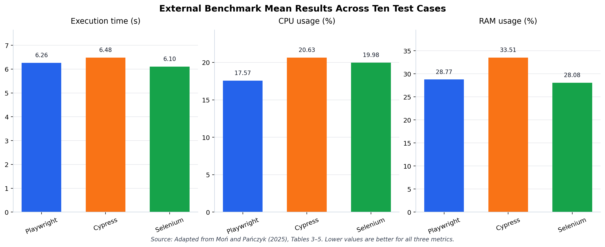
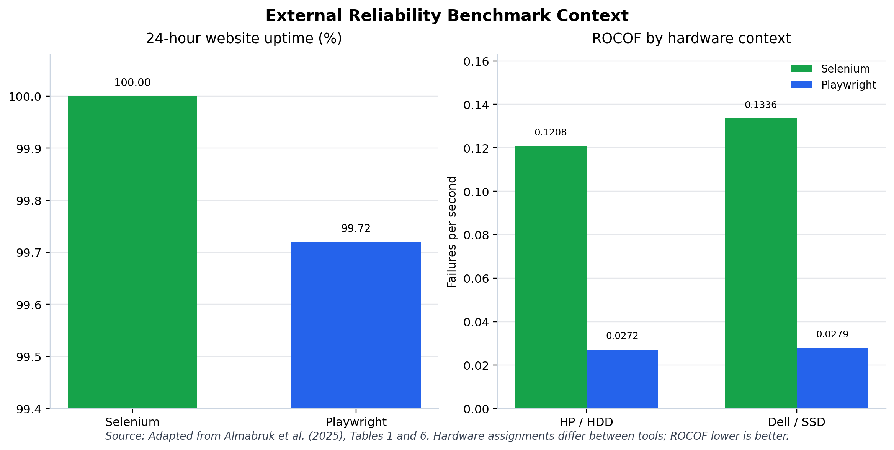
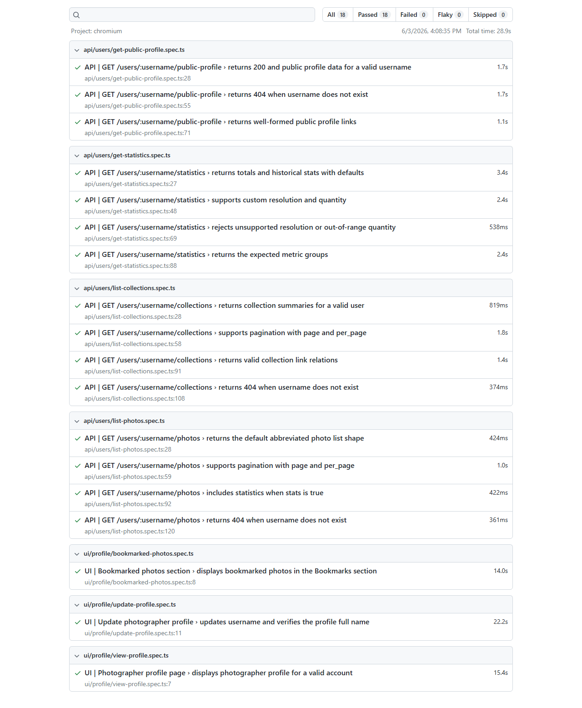
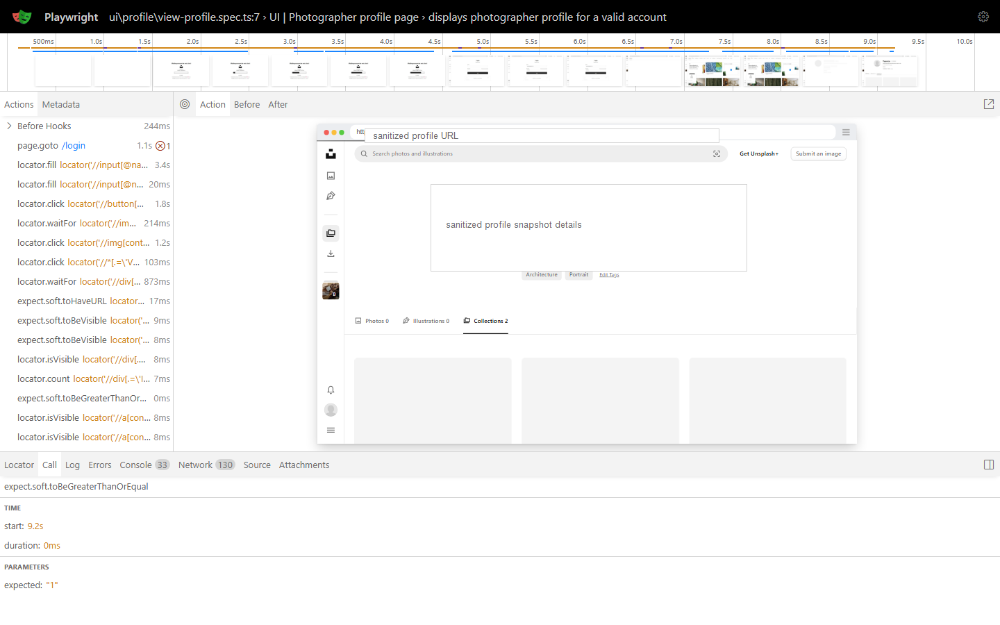

# Chapter 5: Evaluation and Discussion

## 5.1 Evaluation Approach and Evidence Basis

This chapter evaluates the research along two complementary strands. The first strand justifies the selection of Playwright as the automation tool for the proposed framework by examining it against Cypress and Selenium through a set of project-specific criteria, a capability comparison grounded in official documentation and academic literature, and external empirical benchmark context. The second strand evaluates the implemented Playwright and TypeScript framework itself, using the verified test execution evidence collected on 3 June 2026, the associated reporting artifacts, and a qualitative discussion of automation value relative to manual testing. The chapter then interprets these findings in relation to the four research questions established in Chapter 1 and consolidates all evaluation boundaries in a single section.

Each strand draws on a distinct evidence type, and each evidence type carries a distinct boundary. Tool-capability claims rest on official documentation and a recent academic comparison of the three tools, whereas execution claims rest only on a single verified local run of the implemented framework. To prevent these boundaries from being scattered throughout the chapter, Table 5.1 states the top-level evidence basis and the principal limitation for each strand; the complete and authoritative set of evaluation boundaries is consolidated later in Section 5.7 rather than repeated across sections.

| Evaluation strand | Primary evidence used | What the evidence supports | Top-level boundary |
|---|---|---|---|
| Tool selection | Official Playwright, Cypress, and Selenium documentation; academic comparison literature; an author-constructed weighted rubric | Capability comparison and project-fit ranking of the three tools | Not a local benchmark of Cypress or Selenium |
| Framework execution | Verified `npx playwright test` run on 3 June 2026; HTML report, JUnit XML, and a supplemental trace artifact | Observed execution outcome and reviewable evidence for the selected scenarios | A single passing local run does not establish long-term reliability |

*Table 5.1. Evidence basis and top-level boundaries for the two evaluation strands.*

The remainder of the chapter develops these two strands in turn, beginning with the criteria that frame the tool-selection decision.

## 5.2 Tool Selection Criteria and Weighting

The selection of an automation tool for this research is not an abstract preference but a decision constrained by the technical character of the proposed framework, which combines browser-based UI automation and public API testing within a single TypeScript codebase organized around Page Objects, fixtures, and service-layer abstractions. Because these architectural commitments were established before the tool decision, the selection criteria must reflect them directly rather than evaluating tools against generic automation needs. Accordingly, the criteria below weight cross-cutting concerns such as combined UI and API support, synchronization reliability for dynamic interfaces, and architectural fit more heavily than peripheral concerns, while still accounting for secondary factors such as ecosystem maturity and cost that influence the framework's maintainability beyond the duration of this project.

Table 5.2 defines the eleven project-specific criteria, grouped into primary and secondary concerns, together with a weight on a one-to-five scale and the rationale that ties each criterion to the requirements of this research.

| Criteria group | Criterion | Weight | Reason for this project |
|---|---|---:|---|
| Primary | Browser engine coverage and project browser fit | 5 | UI automation must execute browser interactions reliably and remain extensible beyond a single-browser assumption. |
| Primary | Synchronization and action reliability for dynamic UI | 5 | The selected Unsplash UI scenarios depend on waiting for visible state, action readiness, navigation, and assertions. |
| Primary | UI and API testing support in the same framework | 5 | The research deliberately combines browser-based UI tests and public API tests rather than treating them as unrelated suites. |
| Primary | TypeScript, POM, fixture, and service-layer architecture fit | 4 | The framework is implemented in TypeScript and relies on Page Objects, fixtures, workflows, API services, DTOs, and utilities. |
| Primary | Reporting, trace, and debugging artifacts | 4 | The evaluation requires verifiable report evidence, and the framework needs debugging support for failed automation runs. |
| Primary | Parallel and CI-ready execution | 4 | The framework should be prepared for future continuous integration use, even though no verified CI run is claimed in this thesis. |
| Primary | Setup simplicity for a Node.js project | 3 | The framework should remain reproducible for future engineers through documented commands and minimal tool fragmentation. |
| Secondary | Ecosystem maturity and long-term support | 3 | Community size, documentation quality, and tool maturity affect maintainability after the project concludes. |
| Secondary | Cost and open-source availability | 2 | The graduation project should remain reproducible without paid tool lock-in. |
| Secondary | Learning and documentation fit | 3 | The framework should be understandable to new automation engineers and maintainable by future contributors. |
| Secondary | Extensibility beyond current scope | 3 | Future work may add UI flows, API coverage, schema validation, CI dashboards, visual testing, or accessibility checks. |

*Table 5.2. Tool selection criteria and project-specific weights.*

These weighted criteria provide the rubric against which the three candidate tools are compared in the following section.

## 5.3 Comparative Analysis of Playwright, Cypress, and Selenium

### 5.3.1 Capability Comparison

Playwright, Cypress, and Selenium are all credible automation tools, but each occupies a distinct position with respect to the criteria defined above, and the comparison is therefore framed as one of fit rather than of absolute quality. Playwright integrates cross-browser automation, an actionability-based synchronization model, fixtures, API request support, reporters, and tracing within a single Playwright Test ecosystem, which aligns closely with a project that combines UI and API testing in TypeScript. Cypress is well suited to JavaScript-centric browser testing and offers a retryability model and command-level HTTP support, while Selenium represents a mature WebDriver ecosystem whose breadth comes at the cost of additional framework assembly for combined UI and API work. The recent comparative study by Mon and Panczyk (2025) evaluated the same three tools through repeated test executions, resource measurement, and documentation review, and it provides external academic context for treating these tools as a coherent comparison set rather than as a ranked hierarchy [@mon_panczyk_tool_comparison_2025].

Table 5.3 summarizes the principal capability dimensions, distributing the supporting documentation references across the rows so that each capability claim is attributed to its corresponding source.

| Evidence dimension | Playwright | Cypress | Selenium | Boundary |
|---|---|---|---|---|
| Browser and platform capability | Chromium, Firefox, and WebKit support through Playwright tooling [@playwright_docs_intro_2026] | Chrome, Firefox, and Edge support, with experimental WebKit [@cypress_browser_support_2026] | Broad WebDriver browser coverage across major browsers [@selenium_docs_browsers_2026] | Browser support alone does not establish reliability |
| Synchronization model | Actionability and web-first auto-waiting model [@playwright_docs_actionability_2026] | Retryability for queries and assertions [@cypress_docs_retryability_2026] | Explicit and implicit waits, with dynamic-UI timing noted as a common challenge [@selenium_docs_waits_2026] | Actual flakiness requires repeated-run evidence |
| API support | Built-in API testing and request contexts [@playwright_docs_api_testing_2026] | `cy.request()` issues HTTP requests [@cypress_docs_request_2026] | WebDriver is browser-focused; API testing typically needs additional libraries [@selenium_webdriver_2026] | This project needs UI and API support together |
| Reporting and debugging | Built-in HTML and JUnit reporters [@playwright_docs_reporters_2026] and a trace viewer [@playwright_docs_trace_viewer_2026] | Screenshots, videos, and configurable reporters [@cypress_docs_screenshots_videos_2026; @cypress_docs_reporters_2026] | Reporting and debugging depend more on surrounding integrations [@selenium_page_object_models_2026] | Artifact availability differs from project-specific evidence |
| Parallel execution | Worker-based parallelism and retries [@playwright_docs_parallelism_2026; @playwright_docs_retries_2026] | Cloud-supported parallelization [@cypress_docs_parallelization_2026] | Distributed execution through Selenium Grid [@selenium_docs_grid_2026] | Parallel capability does not by itself prove stability |
| Academic comparison context | Reported effective and flexible across most tested cases [@mon_panczyk_tool_comparison_2025] | JavaScript and TypeScript focus with a strong developer experience | Mature and multi-language, with a long browser-automation history | External study results are not this project's measured results |

*Table 5.3. Capability and literature summary for Playwright, Cypress, and Selenium.*

The capability comparison indicates that all three tools satisfy the basic requirements of browser automation, but only Playwright provides combined UI and API support, integrated reporting, and tracing without additional assembly, which is the decisive consideration for a framework that treats UI and API testing as a unified concern.

### 5.3.2 Weighted Framework Evaluation

The capability comparison is qualitative; to translate it into a defensible decision, the criteria and weights from Section 5.2 are applied as a scoring rubric in Table 5.4. This table reflects a project-specific evaluation rubric, not an empirical benchmark. Each tool receives a score on the one-to-five scale for every criterion, the score is multiplied by the criterion weight, and the weighted values are summed into primary and secondary subtotals and a final total.

| Evaluation criterion | Weight | Playwright | Playwright weighted | Cypress | Cypress weighted | Selenium | Selenium weighted |
|---|---:|---:|---:|---:|---:|---:|---:|
| Browser engine coverage and project browser fit | 5 | 5 | 25 | 4 | 20 | 5 | 25 |
| Synchronization and action reliability for dynamic UI | 5 | 5 | 25 | 5 | 25 | 3 | 15 |
| UI and API testing support in the same framework | 5 | 5 | 25 | 4 | 20 | 2 | 10 |
| TypeScript, POM, fixture, and service-layer architecture fit | 4 | 5 | 20 | 4 | 16 | 4 | 16 |
| Reporting, trace, and debugging artifacts | 4 | 5 | 20 | 4 | 16 | 3 | 12 |
| Parallel and CI-ready execution | 4 | 5 | 20 | 4 | 16 | 5 | 20 |
| Setup simplicity for a Node.js project | 3 | 5 | 15 | 5 | 15 | 3 | 9 |
| **Primary subtotal** | - | - | **150** | - | **128** | - | **107** |
| Ecosystem maturity and long-term support | 3 | 4 | 12 | 4 | 12 | 5 | 15 |
| Cost and open-source availability | 2 | 5 | 10 | 5 | 10 | 5 | 10 |
| Learning and documentation fit | 3 | 5 | 15 | 5 | 15 | 3 | 9 |
| Extensibility beyond current scope | 3 | 5 | 15 | 4 | 12 | 5 | 15 |
| **Secondary subtotal** | - | - | **52** | - | **49** | - | **49** |
| **Total score** | - | - | **202 (Rank 1)** | - | **177 (Rank 2)** | - | **156 (Rank 3)** |

*Table 5.4. Weighted framework evaluation for this project.*

Under the project-specific rubric, Playwright ranks first with 202 out of a possible 205 points, followed by Cypress with 177 and Selenium with 156. This ordering is best interpreted as a measure of fit with the particular requirements of this research rather than as a claim of universal superiority: Selenium retains clear advantages where broad WebDriver maturity and Grid-based distributed execution are the primary concerns, and Cypress remains well suited to fast, JavaScript-centric UI testing. Playwright is the most appropriate tool for the requirements of this project because it most directly matches the framework's combined UI and API scope, its TypeScript and fixture-oriented architecture, and its reporting and traceability needs within a single ecosystem.

### 5.3.3 External Benchmark Context

The weighted rubric is an author-constructed decision instrument, and it is strengthened when set alongside independent empirical evidence on the same three tools. Two external studies are used here as contextual support rather than as measurements produced by this research: Mon and Panczyk (2025) report mean execution time, CPU usage, and RAM usage across repeated executions of ten test cases [@mon_panczyk_tool_comparison_2025], and Almabruk et al. (2025) report twenty-four-hour uptime and rate-of-occurrence-of-failures (ROCOF) reliability measures for Selenium and Playwright [@almabruk_selenium_playwright_reliability_2025]. These studies used different systems under test, hardware configurations, test designs, and tool versions from this project, and their figures are therefore presented as external context and not as transferable measurements of the implemented framework.

Figure 5.2 presents mean values derived from the Mon and Panczyk benchmark tables. The pattern is one of nuanced trade-offs rather than uniform dominance: in that study, Selenium recorded the lowest mean execution time and RAM usage, while Playwright recorded the lowest mean CPU usage and remained close to Selenium on the other two metrics. The figure therefore supports a measured interpretation in which no single tool is empirically superior across every resource dimension.

*Figure 5.2. Mean execution time, CPU usage, and RAM usage for Playwright, Cypress, and Selenium across ten test cases (lower values are better). Source: Adapted from Moń and Pańczyk (2025), Tables 3–5.*

Figure 5.3 adds reliability context from Almabruk et al. (2025). In their twenty-four-hour observation, Selenium reached full uptime while Playwright reached 99.72 per cent uptime, yet their ROCOF summary reported fewer failures per second for Playwright across the reported hardware contexts. Because the hardware assignments differ between the tools in parts of that study, the result reinforces the interpretation of tool selection as a trade-off among reliability, speed, resource use, architectural fit, and project constraints.

*Figure 5.3. Twenty-four-hour uptime and ROCOF reliability comparison of Selenium and Playwright by hardware context (lower ROCOF is better). Source: Adapted from Almabruk et al. (2025), Tables 1 and 6.*

Taken together, the capability comparison, the weighted rubric, and the external benchmark context support a single bounded conclusion for the first evaluation strand: Playwright is the most appropriate tool for this research because of its alignment with the framework's combined UI and API design, while the external evidence confirms that this selection should be understood as project fit rather than as a universal ranking. With the tool-selection decision established, the chapter turns to the verified execution of the implemented framework.

## 5.4 Verified Test Execution Results

The execution evidence presented in this section derives from a single verified run of the implemented framework, invoked with the command `npx playwright test` on a local development environment. The run began at `2026-06-03T16:08:33.8884807+07:00` and finished at `2026-06-03T16:09:04.3780466+07:00`; the terminal output reported `18 passed (28.9s)`, and the JUnit XML recorded 18 tests, 0 failures, 0 skipped tests, and a total duration of `28.890057` seconds [@execution_test_run_2026; @execution_junit_results_2026].

Table 5.5 summarizes the full-suite outcome, separating the API and UI suites and reporting the combined total.

| Test suite | Tests | Passed | Failed | Skipped | Duration | Evidence |
|---|---:|---:|---:|---:|---:|---|
| API tests | 15 | 15 | 0 | 0 | See per-spec breakdown | JUnit XML and execution log |
| UI tests | 3 | 3 | 0 | 0 | See per-spec breakdown | JUnit XML and execution log |
| Full suite | 18 | 18 | 0 | 0 | 28.890057s | JUnit XML, terminal log, HTML report |

*Table 5.5. Verified local full-suite execution result on 3 June 2026.*

The per-specification breakdown in Table 5.6 shows how the eighteen tests distribute across the four API specification files and the three UI specification files, with the duration recorded for each file in the JUnit XML output.

| Specification file | Type | Tests | Failures | Skipped | Time |
|---|---|---:|---:|---:|---:|
| `tests/api/users/get-public-profile.spec.ts` | API | 3 | 0 | 0 | 4.466s |
| `tests/api/users/get-statistics.spec.ts` | API | 4 | 0 | 0 | 8.782s |
| `tests/api/users/list-collections.spec.ts` | API | 4 | 0 | 0 | 4.405s |
| `tests/api/users/list-photos.spec.ts` | API | 4 | 0 | 0 | 2.254s |
| `tests/ui/profile/bookmarked-photos.spec.ts` | UI | 1 | 0 | 0 | 13.963s |
| `tests/ui/profile/update-profile.spec.ts` | UI | 1 | 0 | 0 | 22.199s |
| `tests/ui/profile/view-profile.spec.ts` | UI | 1 | 0 | 0 | 15.399s |

*Table 5.6. Per-specification breakdown from the verified JUnit XML output.*

Figure 5.1 presents the Playwright HTML report overview captured from the same verified run. The report renders the passing status of each test and the overall duration in a readable form, and it complements the numerical evidence in Tables 5.5 and 5.6, which remains grounded in the execution log and JUnit XML.

*Figure 5.1. Playwright HTML report showing 18 passed tests from the verified 3 June 2026 full-suite run.*

The framework also supports trace-based debugging, although the verified full-suite run produced no trace artifacts. The Playwright configuration collects traces under the `trace: 'on-first-retry'` setting, and because all eighteen tests passed without any retry, no trace was recorded for this run. Figure 5.4 is therefore drawn from a supplemental single-test trace run executed to demonstrate the type of inspection available; it shows the timeline, action list, DOM snapshots, console, network, and source information that the Trace Viewer exposes when a trace is collected [@execution_trace_artifacts_2026].

*Figure 5.4. Playwright Trace Viewer loaded with a representative UI test trace, showing the action timeline, DOM snapshot, and network panel. Screenshot sanitized; profile details removed.*

These results confirm that the implemented framework executed the selected UI and API scenarios successfully and generated reviewable evidence in one verified local run. The outcome should nonetheless be interpreted with care: a single passing local run does not establish long-term reliability, freedom from flakiness, production readiness, or stability across other machines, browsers, networks, and dates.

## 5.5 Automation Value Relative to Manual Testing

Having established the verified execution outcome, it is appropriate to consider what value the automated framework provides relative to performing the same regression checks manually. Comparing automation with manual testing clarifies why a maintainable automated suite is worthwhile for repeatable verification, while also guarding against the assumption that automation displaces manual testing entirely. The literature is consistent on this point: automation is most beneficial for repeatable checks with stable, well-defined expected results, yet the decision of what to automate must weigh execution benefits against creation and maintenance cost [@garousi_mantyla_automation_2016], and automated and manual testing are complementary rather than substitutive activities [@istqb_ctfl_syllabus_2024].

Table 5.7 summarizes this comparison across four dimensions relevant to the regression scenarios in this research.

| Dimension | Manual testing | Automation in this framework |
|---|---|---|
| Repeatability | Each run depends on the tester following steps consistently | A single command re-executes the same selected checks identically |
| Speed and evidence | Repeated navigation and result recording consume human time and produce informal evidence | The verified run executed 18 tests in 28.890057 seconds and produced JUnit XML and an HTML report |
| Human judgment | Strong for exploration, usability, and discovery of unexpected behavior | Limited to encoded assertions and the implemented flows |
| Risk | Human error can occur during repetitive execution | Tests can become stale or yield false confidence if not maintained |

*Table 5.7. Condensed comparison of manual testing and automation for the selected regression scenarios.*

The verified run demonstrates that the framework can perform the selected regression checks repeatably and generate reviewable evidence in a fraction of the time that manual execution would require. It does not, however, quantify the manual effort saved, because no manual timing baseline was measured for this project; any efficiency comparison therefore remains qualitative. Crucially, manual exploratory testing retains judgment-based value that the automated suite cannot replace, particularly for usability assessment and the discovery of behavior that the encoded assertions do not anticipate.

