# Title Page

**THE UNIVERSITY OF DA NANG**

**VNUK INSTITUTE FOR RESEARCH AND EXECUTIVE EDUCATION**

**A COMPREHENSIVE UI AND API AUTOMATION TESTING FRAMEWORK USING PLAYWRIGHT: AN ENTERPRISE-STANDARD APPROACH**

By

**Le Tiep Tuyen**

A THESIS

Submitted in partial fulfillment of the requirements for the degree of

**BACHELOR**

In Computer Science and Engineering

DANANG, 2026

Copyright 2026 Le Tiep Tuyen

---

# Approval Page

This thesis has been approved in partial fulfillment of the requirements for the Degree of Bachelor in Computer Science and Engineering.

VN-UK Institute for Research and Executive Education, The University of Danang

Thesis Advisor: Dr. Le Dinh Dung

Thesis Co-Advisor: None (individual graduation project)

Department Chair/College Dean (Head of Department, Computer Science and Engineering): Dr. Le Dinh Dung

<!-- Defense committee members are intentionally deferred. The committee section will be completed at/after the thesis defense when the panel is assigned. -->
Committee Members: To be completed at the thesis defense.

---

# Table of Contents

Generated automatically in the final formatted document from the approved heading structure.

# List of Figures

Generated automatically in the final formatted document from the approved figure captions.

# List of Tables

Generated automatically in the final formatted document from the approved table captions.

---

# Author Contribution Statement

This thesis is an individual graduation project by Le Tiep Tuyen. The author is responsible for the research, framework design, implementation, testing, documentation, analysis, and thesis writing. Academic supervision and guidance were provided by Dr. Le Dinh Dung.

---

# Acknowledgements

I would like to express my sincere gratitude to my supervisor, Dr. Le Dinh Dung, for his thoughtful guidance, technical insight, and consistent encouragement throughout this graduation project. His feedback on testing methodology and software design substantially shaped the direction and quality of this work.

I am also grateful to the lecturers and staff of the VNUK Institute for Research and Executive Education, The University of Danang, for the academic foundation and supportive learning environment that made this research possible.

---

# Definitions

**Software Testing.** Software testing is the systematic activity of evaluating a software product or system to provide information about quality, detect defects, and support confidence that the system satisfies specified requirements and user needs [@istqb_ctfl_syllabus_2024; @ammann_offutt_testing_2016].

**Test Automation.** Test automation refers to the use of software tools to support or perform testing activities, including test execution, comparison of actual and expected results, reporting, and related test-control activities [@istqb_glossary_test_automation_2026; @garousi_mantyla_automation_2016].

**End-to-End Testing.** End-to-end testing validates integrated application behavior from the perspective of realistic user or system workflows, especially where multiple components, interfaces, and dependencies interact [@leotta_e2e_web_testing_2016].

**UI Testing.** UI testing evaluates user-facing behavior through the graphical interface, including page state, visible content, user interactions, navigation, and assertions against observable browser behavior [@playwright_docs_locators_2026; @playwright_docs_assertions_2026].

**API Testing.** API testing validates application behavior through service or endpoint interactions, commonly checking request execution, response status, response body, headers, and error behavior without relying on browser UI interaction [@playwright_docs_api_testing_2026; @playwright_docs_apirequestcontext_2026].

**Playwright.** Playwright is the browser automation and test-runner technology used in this research to implement TypeScript-based UI and API automation, configure execution behavior, and produce reporting and trace-related artifacts [@playwright_docs_intro_2026; @playwright_docs_configuration_2026].

**Page Object Model.** Page Object Model is a UI automation design pattern in which page-specific locators and operations are encapsulated behind page-oriented objects so that tests can express scenario intent without duplicating low-level UI interaction details [@fowler_page_object_2013; @playwright_docs_pom_2026; @selenium_page_object_models_2026].

**Fixture.** In Playwright Test, a fixture is a reusable setup mechanism that can provide initialized objects or runtime context to tests, supporting shared setup while preserving test isolation [@playwright_docs_fixtures_2026].

**Test Data Management.** Test data management, in this thesis context, refers to the preparation, organization, loading, and restoration of data required for automated test execution, including static data, structured request objects, endpoint constants, and cleanup data where applicable [@istqb_glossary_test_data_preparation_2026; @istqb_glossary_data_driven_testing_2026].

**Continuous Integration.** Continuous integration is treated in this thesis as a future-work execution environment in which automated tests could be run repeatedly on code changes or schedules. The current framework is configured in a CI-aware way, but no verified CI/CD pipeline execution is claimed [@playwright_docs_configuration_2026; @playwright_docs_parallelism_2026].

**Flaky Test.** A flaky test is a test that can produce different outcomes across executions without corresponding changes to the tested code or test code, creating uncertainty in the interpretation of automated test results [@habchi_flaky_tests_2022; @tahir_flakiness_review_2023].

**Trace Viewer.** Playwright Trace Viewer is a debugging and inspection tool for recorded trace artifacts, allowing actions, snapshots, network activity, logs, source information, and related execution details to be reviewed when traces are collected [@playwright_docs_trace_viewer_2026].

**HTML Report.** An HTML report is a Playwright reporter output that presents test execution results in a browser-readable report format for review, debugging, and evidence documentation [@playwright_docs_reporters_2026].

**JUnit Report.** A JUnit report is an XML-style test report output commonly used for machine-readable test-result integration and archival; in this research, Playwright is configured to produce JUnit XML output as part of the verified execution evidence[@playwright_docs_reporters_2026].

---

# List of Abbreviations

| Abbreviation | Full term |
|---|---|
| AI | Artificial Intelligence |
| API | Application Programming Interface |
| CI/CD | Continuous Integration and Continuous Delivery/Deployment |
| CLI | Command-Line Interface |
| DOM | Document Object Model |
| DTO | Data Transfer Object |
| E2E | End-to-End |
| HTML | HyperText Markup Language |
| HTTP | HyperText Transfer Protocol |
| JSON | JavaScript Object Notation |
| POM | Page Object Model |
| UI | User Interface |

---

# Abstract

Modern web applications require reliable validation across both browser-facing user workflows and service-level API behavior. Manual regression testing remains important for exploratory judgment, but repeated UI and API checks can become time-consuming, inconsistent, and difficult to scale when they are performed without automation support. This research designs, implements, and evaluates a maintainable UI and API automation testing framework using Playwright and TypeScript, with Unsplash used as the selected demonstration system under test.

The proposed framework applies an enterprise-style layered structure that separates test specifications from Page Objects, reusable workflows, fixture-based runtime provisioning, service-layer API abstractions, centralized test data, DTOs, constants, utilities, and reporting configuration. The implementation also documents a project-level Copilot Agentic-AI workflow as a support feature for automation test case design, Playwright script generation, and automation code review, while avoiding any claim of measured productivity or quality improvement from that workflow.

The framework was evaluated through a project-specific tool-selection comparison and a verified local Playwright execution run. Playwright was selected over Cypress and Selenium based on its fit with the project's combined UI/API scope, TypeScript-oriented test architecture, fixture support, reporting, trace inspection, and API request capabilities. The verified full-suite execution on 3 June 2026 executed 18 selected tests, including 15 API tests and 3 UI tests, with all 18 tests passing and a JUnit-recorded duration of 28.890057 seconds. The execution produced reviewable evidence through the Playwright HTML report, JUnit XML output, execution log, and a supplemental representative Trace Viewer artifact.

The research contributes a reusable framework design for organizing UI and API automation in a single maintainable Playwright and TypeScript codebase. Its limitations are also explicit: the evaluation is based on a single verified local run, the scenario coverage is representative rather than complete, no verified CI/CD execution or repeated-run flakiness measurement is available, and the comparison with other tools is a project-fit assessment rather than a local benchmark. Future work should therefore extend the framework through CI/CD execution, broader UI and API coverage, non-functional testing, schema validation expansion, and historical reporting.

**Keywords:** Playwright, TypeScript, test automation, UI testing, API testing, Page Object Model, fixtures, automation framework.

---

# Chapter 1: Introduction

## 1.1 Background

Modern web applications combine browser-based user flows, service APIs, authentication, dynamic data, and frequent interface changes. Testing such systems requires more than checking whether a page can be opened. It must also verify whether important user actions behave correctly in the browser and whether the supporting API layer returns expected responses. The ISTQB Foundation Level syllabus describes testing as an activity that supports defect detection, quality evaluation, and decision-making, while also identifying regression testing as a suitable area for automation because repeated checks often need to be executed after software changes [@istqb_ctfl_syllabus_2024].

Manual testing remains valuable for exploratory investigation, usability judgment, and risk-based analysis. However, repeated regression checks can become slow and inconsistent when they depend only on manual execution. Prior research on software test automation notes that automation is most useful when tests are repeatable, the expected outcomes can be evaluated consistently, and the long-term maintenance effort is justified by repeated execution [@garousi_mantyla_automation_2016]. Automation therefore should not be framed as a replacement for human testers, but as a way to support repeatable validation and preserve execution evidence.

This research applies that principle by proposing a Playwright and TypeScript UI and API automation testing framework for modern web applications. Unsplash is used as the selected demonstration system under test because it provides realistic browser flows and public API behavior for evaluating the framework in a concrete context. The proposed framework is designed around reusable automation abstractions rather than isolated scripts, allowing the thesis to discuss both the practical value of automation testing and the engineering design needed to keep automation code maintainable.

## 1.2 Problem Statement

### 1.2.1 Significance of the Problem

A persistent challenge in software testing is that regression checks must be repeated whenever features, dependencies, UI states, or API behavior change. If these checks are performed only manually, testers must repeat navigation steps, data entry, request verification, result recording, and comparison with expected behavior. This increases effort and can introduce inconsistency, especially when the same scenarios are executed many times.

UI testing and API testing also validate different concerns. UI tests confirm whether selected user-facing flows work in the browser, while API tests check service responses, status codes, response structures, and endpoint behavior. A UI-only suite can miss service-layer issues, while an API-only suite cannot fully validate user-facing workflows. Therefore, a practical automation framework should support both layers while keeping their responsibilities separate.

### 1.2.2 Project Problem Statement

This research addresses the problem of designing, implementing, and evaluating a maintainable automation framework that can support both browser-level and API-level regression checks for modern web applications. The project uses selected Unsplash scenarios as a demonstration context, but the framework objective is broader than a single website: it investigates how reusable automation abstractions can organize scenario intent, runtime setup, UI interaction, API request handling, test data, and reporting evidence in a coherent framework.

The study is intentionally bounded. It does not claim complete Unsplash coverage, full API coverage, production CI/CD readiness, a measured manual-testing baseline, long-term reliability, or quantified productivity improvement from the project Copilot Agentic-AI workflow. These boundaries keep the thesis focused on the implemented framework design and the verified execution evidence that is available for evaluation.

## 1.3 Research Objectives

The main objective of this project is to design, implement, and evaluate a maintainable UI and API automation testing framework using Playwright and TypeScript. The framework is demonstrated through selected Unsplash web application and public API scenarios, but its design principles are intended to be applicable to comparable modern web applications that require repeatable UI and API regression validation.

To support this objective, the project defines four research objectives, each corresponding to one research question:

1. Analyze how a Playwright and TypeScript framework can structure UI and API automation scenarios for a modern web application in a maintainable way.
2. Design and implement reusable framework abstractions that improve separation of concerns, reduce duplication, and support long-term test-code maintainability.
3. Evaluate the implemented framework using verified Playwright execution evidence, HTML reporting, JUnit XML output, and trace-related debugging support where evidence is available.
4. Identify remaining limitations and future work related to coverage, scalability, reliability, evaluation depth, and workflow support boundaries.

The project-level Copilot Agentic-AI workflow is discussed as a support feature for automation test case design, Playwright script generation, and automation code review, but the thesis does not claim measured productivity improvement from that workflow.

## 1.4 Research Questions

The thesis is guided by four research questions:

**RQ1:** How can a Playwright and TypeScript framework be structured to support both UI and API automation testing in a maintainable way?

**RQ2:** How can reusable framework abstractions improve maintainability, reusability, and separation of concerns in web automation testing?

**RQ3:** What evidence does the implemented framework provide for validating selected UI and API behavior in the demonstration system?

**RQ4:** What limitations remain in the implemented framework, and what future work is required to improve coverage, scalability, reliability, and evaluation depth?

---

# Chapter 2: Literature Review

## 2.1 Software Testing Fundamentals

Software testing is commonly treated as a structured quality-assurance activity that evaluates software behavior against selected criteria, expected outcomes, and stakeholder needs. Ammann and Offutt describe testing through the use of systematic criteria for evaluating software structures and behaviors, while the ISTQB Foundation Level syllabus frames testing as an activity that supports defect detection, quality evaluation, and decision-making across the software lifecycle [@ammann_offutt_testing_2016; @istqb_ctfl_syllabus_2024]. This theoretical foundation is important because testing is not only the act of executing steps; it also includes designing checks, observing behavior, comparing actual and expected results, and communicating evidence.

Bertolino characterizes software testing research as a long-standing discipline concerned with improving fault detection, validation, cost-effectiveness, and confidence in software systems [@bertolino_testing_research_2007]. In this thesis, that broader view is used to position automation testing as one part of a wider testing strategy rather than as a standalone tool activity.

The ISTQB syllabus distinguishes verification and validation concerns. Verification asks whether a work product satisfies specified requirements, while validation asks whether the system is suitable for its intended use [@istqb_ctfl_syllabus_2024]. Automated tests should therefore contain meaningful assertions, not only automated actions. A browser script or API request has limited value if it does not verify an expected result.

Regression testing is especially relevant to automation because it repeats previously defined checks after software or environment changes [@istqb_ctfl_syllabus_2024]. Exploratory testing remains different because it depends on tester learning, investigation, and human judgment. This distinction frames a central thesis position: automation can strengthen repeatable regression checks, but it should not be presented as a complete replacement for human testing expertise.

## 2.2 Manual Testing and Automated Testing Approaches

Manual and automated testing represent complementary execution approaches. Manual testing relies on a human tester to perform actions, observe behavior, and interpret outcomes, while the ISTQB Glossary defines test automation as the use of software to perform or support activities such as test management, test design, test execution, and result checking [@istqb_glossary_test_automation_2026]. This distinction is methodological: the key difference is not whether the test is valuable, but how the test activity is executed, observed, and recorded.

Garousi and Mantyla's multivocal literature review emphasizes that automation is most appropriate when the test is repeatable, the expected result can be checked reliably, and the cost of building and maintaining automation can be justified by repeated use [@garousi_mantyla_automation_2016]. Manual testing remains suitable for exploratory investigation, usability judgment, new or unstable behavior, and cases where expected results require human interpretation. Automated testing is more suitable for stable, repeatable, and evidence-oriented checks that justify script design and maintenance effort [@istqb_ctfl_syllabus_2024; @garousi_mantyla_automation_2016].

Table 2.1 summarizes the methodological distinction.

| Dimension | Manual testing | Automated testing | Methodological implication |
|---|---|---|---|
| Execution | Human tester performs the steps. | Tool executes predefined scripts. | Automation fits repeatable checks. |
| Judgment | Strong for exploration and usability. | Limited to encoded assertions. | Human testing remains necessary. |
| Evidence | Depends on tester notes, screenshots, or reports. | Can generate logs, reports, traces, and structured results. | Automated evidence supports later review. |
| Maintenance | Knowledge may remain informal. | Scripts require updates when behavior changes. | Framework design affects long-term usefulness. |
| Cost pattern | Lower initial technical setup. | Higher initial setup but reusable over repeated runs. | Suitability depends on stability and repetition. |

*Table 2.1. Manual and automated testing approaches.*

Table 2.2 gives a simplified example of how the same test intent can appear in manual and automated forms. The table is illustrative rather than project-result evidence.

| Test intent | Manual test case representation | Automation script representation |
|---|---|---|
| Start from the target page. | Open the browser and navigate to the application page. | Navigation command or shared workflow setup. |
| Enter required data. | Type values into visible fields. | Data is loaded from a fixture, object, or data file. |
| Perform the user action. | Click the relevant button or link. | Page-level action method or locator interaction. |
| Check expected behavior. | Observe message, page state, or displayed data. | Assertion compares actual outcome against the expected result. |
| Preserve evidence. | Record notes or capture screenshots manually. | Test runner produces logs, reports, traces, or result files. |

*Table 2.2. Manual test case and automation script representations.*

## 2.3 Test Automation in Modern Web Application Testing

Automated web testing is challenging because modern web applications combine dynamic user interfaces, asynchronous requests, authentication, third-party services, and frequently changing page content. Leotta, Clerissi, Ricca, and Tonella describe automated end-to-end web testing as an important but difficult area because tests must interact with changing web interfaces and integrated application behavior [@leotta_e2e_web_testing_2016]. These characteristics make automated web testing valuable, but they also make it fragile when selectors, waiting logic, and test data are poorly managed.

Playwright documentation addresses some of these web-testing concerns through locator strategies, actionability checks, and web-first assertions, which are intended to interact with dynamic pages more reliably than raw timing assumptions [@playwright_docs_locators_2026; @playwright_docs_actionability_2026; @playwright_docs_assertions_2026]. These capabilities support automation, but they do not remove the need for good test design and maintainable framework structure.

From a methodology perspective, a web automation suite should not become a collection of isolated scripts. Repeated navigation, setup, selectors, data, and expected results should be organized so that tests remain readable and maintainable. Garousi and Felderer argue that automated test scripts should be developed and maintained with the same engineering attention given to production code [@garousi_felderer_test_scripts_2016]. This is why test automation is treated in this thesis as a software engineering activity, not only as tool usage.

## 2.4 End-to-End Testing Methodology

End-to-end testing validates an integrated user-facing flow across the relevant parts of a system. In web testing, this usually includes navigation, user actions, visible states, and expected outcomes in the browser. Leotta et al. describe E2E web testing as a way to exercise application behavior through user-oriented workflows, while also noting that tool and approach selection affects reliability and maintainability [@leotta_e2e_web_testing_2016].

End-to-end testing is valuable because it is close to user behavior, but it can also be more expensive and fragile than lower-level checks when scenarios are too broad or poorly isolated. Flaky tests are a major risk in this context. A flaky test can pass or fail inconsistently without a corresponding product change, reducing trust in automated results. Research identifies common causes such as asynchronous waits, environment dependency, test order dependency, external services, and unstable test data [@habchi_flaky_tests_2022; @tahir_flakiness_review_2023].

For this reason, end-to-end automation should focus on representative, stable, and meaningful flows. From this perspective, API-level checks can complement browser-oriented end-to-end tests by validating service boundaries closer to the interface under test, helping to avoid placing all automated confidence in the browser suite [@leotta_e2e_web_testing_2016; @istqb_ctfl_syllabus_2024].

## 2.5 Test Case Design for Automated Testing

The ISTQB Glossary defines a test case through input values, execution preconditions, expected results, and postconditions developed for a test objective or condition [@istqb_glossary_test_case_2026]. Ammann and Offutt also emphasize that effective software testing requires systematic criteria rather than arbitrary execution [@ammann_offutt_testing_2016]. These ideas apply directly to automation: before writing a script, the tester should understand what behavior is being checked, what data is required, what state must exist, what assertion proves the behavior, and what evidence should be preserved.

Automated test case design also requires scope control. A test that covers too much behavior can be difficult to debug, while a test that covers too little behavior may not provide useful confidence. UI automation should identify the user flow, page states, stable interaction points, and observable expected result. API automation should identify the endpoint, request data, authentication assumption, expected status code, response fields, and error case.

Table 2.3 presents an author-synthesized summary of the test design considerations used as methodological guidance for this thesis, drawing on ISTQB test-case design guidance [@istqb_glossary_test_case_2026] and systematic testing criteria [@ammann_offutt_testing_2016].

| Design consideration | Purpose in automated testing |
|---|---|
| Scenario purpose | Explains what risk or behavior the test validates. |
| Preconditions | Defines required account, data, browser, or API state. |
| Test data | Separates input values and expected values from test intent. |
| Assertion points | Prevents scripts from becoming action-only automation. |
| Cleanup/reset | Protects repeatability when a test changes application state. |
| Evidence artifact | Connects execution to reports, logs, traces, or result files. |

*Table 2.3. Test case design considerations for automated testing.*

## 2.6 Test Automation Framework Concepts

The ISTQB Glossary defines a test automation framework as a tool-supported environment for automation that usually includes a test harness and test libraries [@istqb_glossary_test_automation_framework_2026]. The ISTQB Test Automation Engineering syllabus extends this view by discussing test automation architecture, framework layering, test definition, test execution, test adaptation, logging, reporting, and maintainability concerns [@istqb_ctal_tae_syllabus_2024]. Garousi and Felderer further support this interpretation by treating automated test scripts as test code that requires development, quality assessment, and maintenance [@garousi_felderer_test_scripts_2016].

This literature suggests that a framework is more than a folder containing scripts. A useful automation framework provides structure for defining tests, executing them, adapting them to the system under test, managing data and configuration, and reviewing results. Table 2.4 presents an author-synthesized summary of these framework concepts as the theoretical baseline for Chapter 3; the "Design implication for later chapters" column represents author-derived inference from the cited literature rather than a direct quotation from any single source.

| Framework concept | Literature-based role | Design implication for later chapters |
|---|---|---|
| Test definition | Describes test cases, suites, and expected behavior. | Test files should express scenario intent. |
| Test execution | Runs tests and records execution information. | A test runner and reporter configuration are needed. |
| Test adaptation | Connects tests to the system interface, such as UI or API. | UI and API abstractions should separate interface details. |
| Test data and configuration | Supplies repeatable data and environment values. | Data and runtime settings should not be hardcoded everywhere. |
| Test libraries/utilities | Provide reusable operations and support maintainable test code. | Shared helpers reduce duplicated test code. |
| Reporting and logging | Communicate activities, results, and failure context. | Generated artifacts support debugging and evaluation. |

*Table 2.4. Literature-based concepts of a test automation framework.*

Several design concepts can realize these framework responsibilities. Page Object Model is one example for UI abstraction: Fowler describes a Page Object as an application-specific API over a page, while Selenium and Playwright documentation also present Page Objects as a way to keep page interaction details out of test specifications [@fowler_page_object_2013; @selenium_page_object_models_2026; @playwright_docs_pom_2026]. This chapter introduces POM as a design-pattern concept from the automation testing literature; the project application through Page Objects, fixtures, API services, DTOs, and related mechanisms is discussed in Chapter 3.

## 2.7 Test Data Generation and Reporting in Automated Testing

Test data is a central concern in automation because automated checks require known input values, expected outputs, and repeatable state. The ISTQB Glossary defines test data preparation as the activity of selecting, creating, generating, manipulating, or editing data for testing [@istqb_glossary_test_data_preparation_2026]. Data-driven testing further separates test logic from input and expected data, allowing the same control script to run with different data sets [@istqb_glossary_data_driven_testing_2026; @microsoft_data_driven_testing_2021].

Reporting is equally important because automated execution must produce interpretable evidence. The ISTQB Glossary defines a test report as documentation that summarizes test activities and results [@istqb_glossary_test_report_2026]. In automated testing, this evidence may include pass/fail status, logs, traces, screenshots, videos, XML result files, or HTML summaries depending on the tool and configuration. This connects reporting to accountability: automated tests are more useful when their results can be reviewed and diagnosed after execution.

Playwright provides built-in reporting and trace-viewing support, including HTML reporting, JUnit XML output, and trace artifacts for debugging recorded test actions and context [@playwright_docs_reporters_2026; @playwright_docs_trace_viewer_2026]. These sources provide the theoretical basis for the later evaluation chapter. Execution evidence and verified report artifacts are discussed in Chapter 5; this chapter presents reporting only as a methodology concern.

---

# Chapter 3: Framework Design

## 3.1 Overall Framework Architecture

The proposed framework is designed as a layered Playwright and TypeScript automation framework for modern web applications, demonstrated through selected Unsplash UI and public API scenarios. Its main design goal is to separate scenario intent from low-level interaction details, request construction, runtime setup, test data, and reporting configuration. This structure follows the implementation evidence described in the project documentation and source-code layout.

Figure 3.1 presents the overall architecture. The top layer contains UI and API test specifications. UI tests express browser-based user flows, while API tests express endpoint-level validation. Supporting layers provide Page Objects, workflows, API services, fixtures, core utilities, DTOs, constants, configuration, test data, and reporting support.


*Figure 3.1. Layered architecture of the Playwright UI and API automation framework.*

The architecture assigns each concern to a distinct layer. Test specifications reside under `tests/ui/` and `tests/api/`; page-level abstractions under `page-object/`; reusable business workflows under `workflow/`; fixture definitions under `fixtures/` and `core/fixtures/`; service logic under `api-service/`; shared utilities under `core/`; and data and configuration concerns under `data-object/`, `constants/`, `test-data/`, `config/`, and `utils/`.

The framework is intentionally scoped. It is not designed to prove complete Unsplash coverage, full security testing, visual regression testing, accessibility testing, or production CI/CD maturity. Instead, it demonstrates how a maintainable framework can support representative UI and API automation with clear design boundaries.

The framework is demonstrated through Unsplash as the selected system under test. Figure 3.12 provides a visual context for the public web interface used by the browser-oriented scenarios, while Figure 3.13 shows the official Unsplash API documentation context that informs the API-oriented scenario selection. These screenshots are included only as contextual visual evidence; they do not extend the tested coverage beyond the selected scenarios described in this chapter and evaluated in Chapter 5.

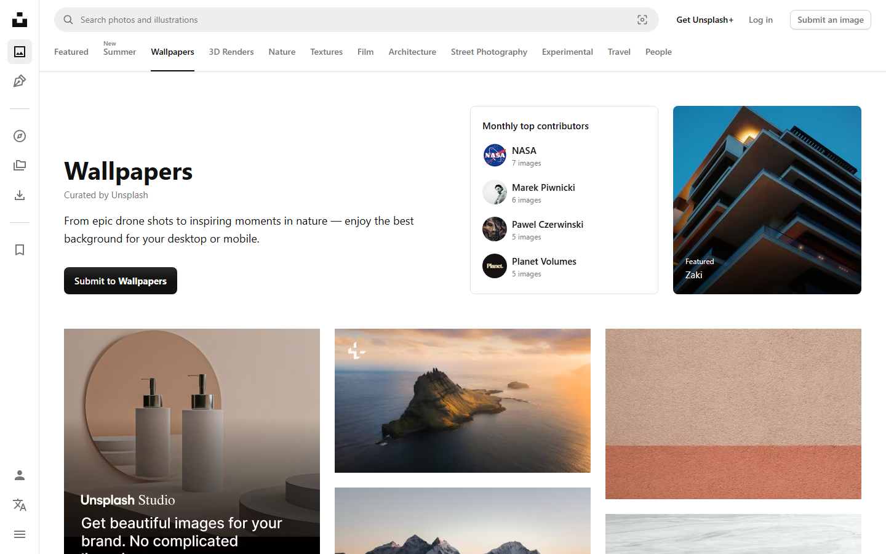

*Figure 3.12. Public Unsplash web interface used as contextual system-under-test evidence.*

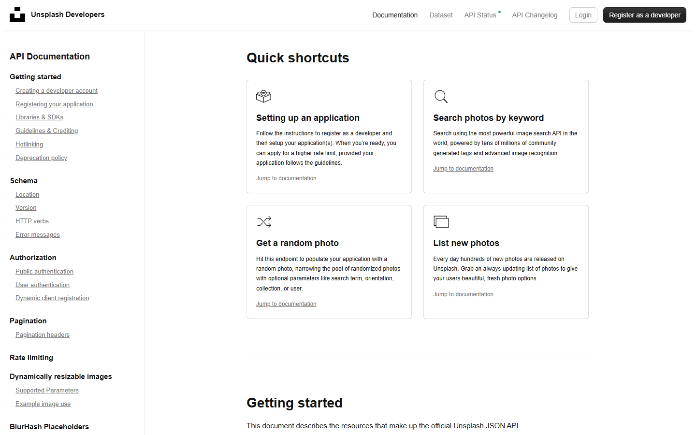

*Figure 3.13. Official Unsplash API documentation context for the selected public API scenarios.*

## 3.2 UI Abstraction Design

### 3.2.1 Page Object Model Concept

The UI automation layer applies the Page Object Model to keep selectors and page-level interactions outside test specifications. Page Object Model literature describes this pattern as an application-specific API over a page or page fragment, allowing tests to interact with meaningful page behavior instead of manipulating raw UI details directly [@fowler_page_object_2013; @selenium_page_object_models_2026; @playwright_docs_pom_2026]. Playwright's own Page Object guidance presents page classes as application-facing abstractions over repeated page interactions, reinforcing the same separation recommended by the broader POM literature.

Figure 3.2 explains the concept at a design level. A test begins from user-visible intent, expresses steps and assertions in a test specification, calls Page Object methods, and leaves locator resolution and browser interaction to lower-level framework objects. This separation helps readers distinguish between what the test verifies and how the framework performs the interaction.


*Figure 3.2. Page Object Model concept from test intent to browser interaction.*

### 3.2.2 Page-Level and Element-Level Abstraction

In the implemented framework, Page Object classes such as `HomePage`, `LoginPage`, `ProfilePage`, and `AccountPage` encapsulate the UI interactions needed for browser-based scenarios. Among these, `ProfilePage` and `AccountPage` are directly involved in profile-viewing and profile-update flows, while `HomePage` and `LoginPage` handle navigation and authentication. This allows a test to call methods such as opening a profile, clicking an edit-profile button, filling profile fields, or checking a visible message, while page-specific selector and action details remain in the Page Object layer.

The implemented framework also uses an element wrapper under `core/element/element.ts`. Playwright recommends user-facing locators and provides locator APIs for role, text, label, placeholder, alternative text, title, test id, and default locator expressions[@playwright_docs_locators_2026]. The project wrapper centralizes common locator operations and checks around these strategies. While Playwright documentation recommends user-facing locators for resilience, the implemented Page Objects use a combination of locator strategies, including XPath-based selectors through the default locator type, depending on the available UI structure. This combination reduces duplicated low-level Playwright calls inside Page Objects and supports more consistent UI interaction handling.

### 3.2.3 Practical Page Object Workflow

A Page Object design becomes useful only when it is applied consistently during test development. When automating a UI scenario, the tester should first understand the manual scenario, identify the relevant page states, inspect the DOM for reliable locator candidates, map each important page or UI area to a Page Object, and then implement page-level methods that describe user-meaningful actions [@fowler_page_object_2013; @playwright_docs_locators_2026].

Figure 3.3 illustrates this practical workflow. The process begins with manual scenario understanding because automation should not be written before the tester knows the intended flow and expected outcome. The next step is locator discovery through browser inspection and Playwright-oriented locator selection. After that, the tester maps pages or UI areas to Page Object responsibilities and writes test code that consumes those Page Objects through fixtures.


*Figure 3.3. Practical workflow for applying the Page Object Model in an automation testing project.*

This workflow clarifies the placement of Page Object Model in the thesis. Chapter 2 introduced POM as a general automation concept from the literature; this chapter explains how the project applies POM as a concrete UI abstraction boundary.

## 3.3 Runtime Composition Design

### 3.3.1 Fixture-Based Dependency Provisioning

The framework uses Playwright fixtures to provide reusable objects and runtime context to tests. Playwright supports custom fixtures through `test.extend()`, allowing a project to define setup logic and make objects available to test functions [@playwright_docs_fixtures_2026]. Fowler describes dependency injection as an approach in which configuration and object construction responsibilities are separated from the consuming code [@fowler_dependency_injection_2004]; the fixture-based provisioning in this framework applies the same principle, providing reusable objects to test functions through framework setup rather than inline construction.

Figure 3.4 shows the fixture-based dependency injection flow. The Playwright runtime provides browser, context, page, and request objects. The base fixture initializes shared runtime references through `BrowserManagement`. The custom fixture then creates reusable Page Objects and `LoginWorkflow`, and test specifications consume those objects as typed fixture parameters.


*Figure 3.4. Fixture-based dependency injection and shared runtime context.*

### 3.3.2 Shared Runtime Context

The shared runtime context is the mechanism that makes the active Playwright browser page and API request context available to framework utilities after fixture initialization. In this framework, the automatic base fixture receives Playwright's `browser`, `context`, `page`, and `request` objects and stores them through `BrowserManagement`; the custom fixture then provides Page Objects and workflow objects to test specifications[@playwright_docs_fixtures_2026].

Figure 3.5 summarizes this runtime relationship. It separates the Playwright runtime objects, the base fixture initialization step, the shared `BrowserManagement` references, the custom fixture objects, and the test scenario that consumes the injected abstractions.


*Figure 3.5. Shared runtime context flow through Playwright fixtures and framework utilities.*

This design keeps test files focused on scenario behavior because a UI test can import `test` and `expect` from the custom fixture layer and receive objects such as `homePage`, `profilePage`, `accountPage`, and `loginWorkflow`. This thesis therefore describes the runtime context as an implemented design mechanism, not as evidence of long-term runtime reliability.

## 3.4 API Automation Design

### 3.4.1 Service-Layer Abstraction

The API automation layer is designed around service classes. API testing validates behavior at the service boundary, including status codes, response bodies, headers, endpoint behavior, and error responses. Playwright supports HTTP request execution through API request contexts and methods such as GET, POST, PUT, and DELETE [@playwright_docs_api_testing_2026; @playwright_docs_apirequestcontext_2026].

Service-layer abstraction keeps endpoint construction outside individual test files. Fowler describes a service layer as a boundary that defines available operations for client layers [@fowler_service_layer_2003]. In this framework, the same idea is applied to API tests: test specifications call meaningful service methods, while URL construction, endpoint constants, authorization headers, request utilities, and response handling remain in supporting layers.

Figure 3.6 presents the API service abstraction and validation pipeline. The test specification calls a service method. The service method combines endpoint constants, URL helpers, optional authorization headers, and request data. The request is executed through shared API utilities, which access the Playwright request context through the shared `BrowserManagement` reference initialized by the base fixture (Section 3.3.2), and the test validates status codes, body fields, headers, error cases, or schema-related expectations where implemented.


*Figure 3.6. API service abstraction and validation pipeline.*

### 3.4.2 Request Execution and Validation Scope

The implemented framework realizes this design through `UsersService` and `PhotosService`. `UsersService` encapsulates public profile retrieval, user photos, user collections, user statistics, and current-user profile update operations. `PhotosService` encapsulates random-photo retrieval, like, and unlike operations. Endpoint paths are centralized in `constants/api-endpoints.ts`, API URLs are constructed through `utils/api-url.ts`, and HTTP methods are executed through `core/api/api.ts`.

The API utility layer also contains JSON schema validation support through Ajv. JSON Schema is a declarative approach for describing and validating JSON document structure[@json_schema_overview_2026]. This chapter therefore describes schema validation as an available utility capability, but it does not claim broad schema-validation coverage because that would require specific test coverage and execution evidence.

## 3.5 Test Data and State Management Design

### 3.5.1 Centralized Test Data and Configuration

Maintainable automation separates scenario logic from test data, structured request objects, endpoint constants, and environment-specific values. Data-driven testing stores input and expected data separately from the control script, allowing test logic to remain stable while data changes [@istqb_glossary_data_driven_testing_2026; @microsoft_data_driven_testing_2021]. DTOs provide structured data objects that carry data across a boundary [@fowler_data_transfer_object_2003].

Figure 3.7 shows the relationship among test data, DTOs, scenario execution, API support, and cleanup. The test loads static or environment-aware data, uses DTOs when structured request data is needed, executes UI or API behavior, and can call an API cleanup operation after a state-changing UI scenario.


*Figure 3.7. Test data, DTO, and cleanup strategy for repeatable automation.*

The implemented framework applies these ideas through `test-data/user-info.json`, `utils/json.ts`, `constants/file-paths.ts`, `constants/api-endpoints.ts`, `utils/api-url.ts`, and DTO/model files under `data-object/`. Runtime values such as base URLs are loaded from environment variables, keeping environment-specific values outside the committed test code.

### 3.5.2 State Reset Through API Cleanup

The update-profile UI scenario demonstrates the cleanup strategy. After a profile update, the test constructs an `UpdateUserProfileRequestData` object and calls `UsersService.updateCurrentUserProfile()` in `test.afterEach()` to restore the original username. This supports the design claim that API-based cleanup is implemented.

The cleanup mechanism should be interpreted cautiously. It shows that the framework includes a reset path for a state-changing UI scenario, but it does not by itself prove long-term cleanup reliability. That claim would require repeated execution evidence and stability analysis, which belongs to evaluation rather than framework design.

## 3.6 Framework Quality Design

### 3.6.1 Design Principles and Quality Goals

The framework combines several design mechanisms to support maintainability, reusability, readability, traceability, and debuggability. In software quality discussion, maintainability and related quality attributes are treated as design concerns rather than automatic outcomes [@iso_25010_2023]. In test automation research, automated scripts also require engineering attention because test code must be developed, assessed, and maintained over time [@garousi_felderer_test_scripts_2016]. In this framework, these concerns are addressed through Page Objects, element abstraction, workflows, fixtures, service-layer API abstraction, DTOs, centralized constants, configuration helpers, shared utilities, JSON schema validation support, and API-based cleanup. The framework applies object-oriented composition to assign responsibilities to specific classes: Page Objects hold UI interaction logic, service classes hold API request operations, and fixtures hold dependency provisioning. In the sense defined by the SOLID principles, responsibilities are separated across cohesive classes and tests depend on named abstractions rather than raw implementation details, applying the Single Responsibility and Dependency Inversion principles to the extent the framework scope requires [@martin_solid_principles_2000].

Figure 3.8 presents the design mechanisms as a framework concept map. The diagram is a design explanation, not a measured quality result. It shows how different abstractions are intended to support quality attributes used in software product quality discussion, including maintainability, reusability, readability, reliability, debuggability, and traceability [@iso_25010_2023].


*Figure 3.8. Automation framework concept map and quality-attribute relationships.*

Table 3.1 maps major framework concepts to repository evidence.

| Concept | Design responsibility | Repository evidence |
|---|---|---|
| Test specification | Holds scenario intent and assertions. | `tests/ui/`, `tests/api/` |
| Page Object | Encapsulates page-specific UI behavior. | `page-object/` |
| Element abstraction | Centralizes locator operations and checks. | `core/element/element.ts` |
| Workflow | Encapsulates repeated business flow. | `workflow/login-workflow.ts` |
| Fixture | Provides reusable objects and setup. | `fixtures/custome-fixture.ts`, `core/fixtures/base-fixture.ts` |
| API service | Encapsulates endpoint operations. | `api-service/` |
| DTO/model | Represents structured request/response data. | `data-object/` |
| Constants/configuration | Centralizes reusable paths, endpoints, and settings. | `constants/`, `config/`, `utils/`, `playwright.config.ts` |

*Table 3.1. Framework concept responsibility map.*

Evidence boundaries remain important, but they are not retained as a separate design table in this chapter. In a framework-design chapter, such boundaries are clearer when stated in the relevant prose: for example, this chapter may describe implemented abstractions and configuration, while Chapter 5 is responsible for verified execution evidence, pass/fail results, report artifacts, and evaluation limits.

### 3.6.2 Execution Evidence and Debugging Support

#### 3.6.2.1 Reporting Artifacts

Reporting is part of framework design because automated tests must produce evidence that can be reviewed. Playwright documentation describes reporter support, including HTML reporting and JUnit XML output[@playwright_docs_reporters_2026]. The implemented framework configures HTML reporting and JUnit output to `results.xml` in `playwright.config.ts`.

#### 3.6.2.2 Debugging and Traceability Scope

Debugging support is also part of the design boundary. Playwright trace viewing can help inspect recorded actions and artifacts when traces are collected[@playwright_docs_trace_viewer_2026]. The implemented framework configures trace collection on first retry, which means trace evidence depends on execution conditions and should not be treated as guaranteed for every passing run.

This design supports traceability in two ways. First, test execution can produce artifacts such as reports and result files. Second, source organization makes it possible to trace a test scenario to Page Objects, workflows, services, DTOs, constants, and utilities. Chapter 5 evaluates verified execution evidence, while this chapter describes only the design that enables such evidence to be produced.

Table 3.2 maps selected quality attributes to framework mechanisms.

| Quality attribute | Framework mechanism | Design interpretation |
|---|---|---|
| Maintainability | Page Objects, services, constants, DTOs, utilities | Supports localized responsibility, but does not constitute a measured maintenance study. |
| Reusability | Fixtures, workflows, services, data helpers | Supported by source structure and reusable object provisioning. |
| Readability | Scenario-level tests and named methods | Expresses test intent through higher-level abstractions. |
| Reliability | Playwright waits/assertions, retries, cleanup design | Requires execution evidence before pass-rate or flakiness claims. |
| Debuggability | HTML report, JUnit XML, trace-on-retry | Actual artifacts belong to Chapter 5 evaluation evidence. |
| Traceability | Source mapping and execution artifacts | Links design mechanisms to source evidence and later execution artifacts. |

*Table 3.2. Quality attributes mapped to framework design mechanisms.*

## 3.7 Automation Execution Flow

### 3.7.1 UI Automation Flow

The UI execution flow begins with a UI test specification. The test receives reusable objects from fixtures, calls workflow and Page Object methods, interacts with the browser through Playwright-supported abstractions, and performs assertions against visible behavior. Figure 3.9 summarizes this flow.

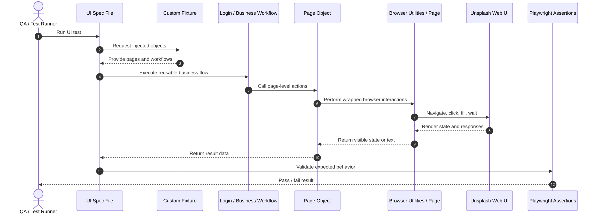

*Figure 3.9. UI automation execution flow using fixtures, workflows, and Page Objects.*

The representative update-profile scenario shows this flow in source code. It loads centralized user data, logs in through `LoginWorkflow`, navigates through Page Objects, updates account data, asserts a success message, navigates to the updated profile URL, and verifies the displayed full name.

### 3.7.2 API Automation Flow

The API execution flow starts with an API test specification. The test calls a service method, the service builds the request from endpoint constants and URL helpers, the request executes through `APIUtils`, and the test validates status code, response body, response fields, headers, or error handling. Figure 3.10 summarizes the API design flow.

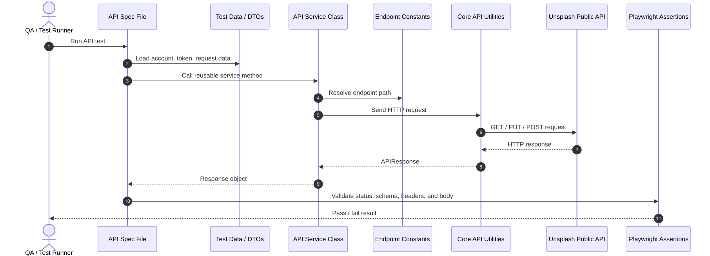

*Figure 3.10. API automation execution flow using service classes and API utilities.*

The representative public-profile API test demonstrates this structure by calling `UsersService.getUserPublicProfile()`, validating a successful public profile response, validating an invalid username response, and checking profile-link patterns. The API tests therefore remain focused on endpoint behavior rather than repeated request-construction details.

## 3.8 Copilot Agentic-AI Workflow Design for Automation Testing

The project also includes a documented Copilot Agentic-AI workflow for automation testing development. This workflow is a support feature around the Playwright framework, not a replacement for the framework architecture. It is described through project artifacts under `docs/agentic-workflow/`, `.github/`, and `.claude/`.

Figure 3.11 summarizes the automation-testing workflow. It begins with framework understanding, continues into automation scenario design, proceeds to framework-aware Playwright script generation, and ends with code review against framework conventions.


*Figure 3.11. Copilot Agentic-AI workflow for automation test development.*

The workflow reinforces the same design principles as the framework itself. It encourages reuse of existing Page Objects, fixtures, workflows, services, DTOs, constants, and utilities before creating new files. It also supports optional UI inspection when selector behavior or page structure is uncertain. Its review stage focuses on framework structure compliance, selector quality, reuse, duplication, and maintainability.

The available evidence describes the workflow as a documented automation-testing support layer; quantitative productivity, defect-reduction, or reliability evaluation of the workflow is outside the scope of this study and would require a dedicated evaluation method.

---

# Chapter 4: Implementation

## 4.1 Implementation Environment and Configuration

The implementation is organized as a Playwright and TypeScript automation framework. The package manifest defines `@playwright/test`, `playwright`, TypeScript-related Node typings, `dotenv`, and `ajv` as the main dependencies used for browser automation, API request support, environment-variable loading, and JSON-schema validation utilities. The project documentation describes direct command-line execution through `npm install`, `npx playwright test`, `npx playwright test --headed`, `npx playwright test --debug`, and `npx playwright show-report`. Because the current package manifest does not define npm script aliases, the implementation is described through these direct Playwright commands rather than through project-specific script names.

The central configuration is implemented in `playwright.config.ts`. It loads environment variables from `config/.env`, uses `process.env.BASE_URL` as the browser base URL, and works with `utils/api-url.ts`, which constructs API URLs from `process.env.API_BASE_URL`. The thesis records these mechanisms at the configuration and variable-name level only. It does not disclose runtime values, access tokens, client identifiers, or credential data.

The Playwright configuration sets `testDir: './tests'`, so both UI and API specifications are discovered under the shared test directory. It defines a Chromium project with Playwright's desktop Chrome device settings, a global timeout of `10 * 60 * 1000`, an action timeout of `10 * 1000`, full parallel execution, CI-only `forbidOnly`, two retries in CI, and a single worker in CI[@playwright_docs_configuration_2026]. These settings describe implementation configuration; they should not be interpreted as measured reliability or performance results.

## 4.2 Implemented Framework Organization

The implemented framework follows the layered design introduced in Chapter 3, but Chapter 4 focuses on the concrete source organization rather than re-explaining the design theory. UI and API test specifications are implemented under `tests/ui/` and `tests/api/`. UI interaction logic is implemented in Page Object classes under `page-object/`, reusable business flows are implemented under `workflow/`, and fixture definitions are implemented under `fixtures/` and `core/fixtures/`.

API-related implementation is separated into service classes under `api-service/`, endpoint constants under `constants/`, request and response models under `data-object/`, and reusable request utilities under `core/api/`. Browser runtime utilities and element wrappers are implemented under `core/browser/` and `core/element/`, while shared helpers for JSON loading and API URL construction are placed under `utils/`. This organization allows test specifications to focus on scenario behavior while reusable framework components handle interaction, request construction, runtime access, and data management.

Figure 4.1 provides a development-environment view of the implemented test organization. The VS Code Test Explorer shows the API and UI test specifications grouped under the shared `tests` directory, while the Playwright panel exposes tooling actions such as locator picking, recording, report output access, and trace-viewer settings. The figure is included as implementation-context evidence only; it does not replace the verified execution results presented in Chapter 5.

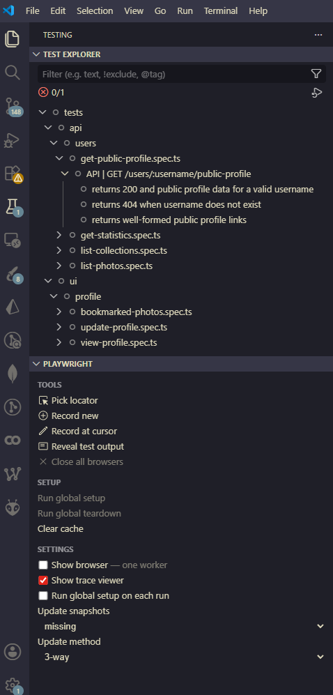

*Figure 4.1. VS Code Test Explorer and Playwright panel showing the implemented API and UI test organisation.*

## 4.3 Runtime and Utility Implementation

The runtime utility layer provides the shared operational support used by both UI and API tests. `core/browser/browser-management.ts` stores references to the active Playwright browser, browser context, page, and API request context after fixture initialization. This allows browser utilities, element wrappers, and API utilities to access the active runtime objects through a single framework utility layer.

The fixture implementation makes these runtime objects and reusable abstractions available to tests. The custom fixture extends the base fixture and injects `HomePage`, `LoginPage`, `ProfilePage`, `AccountPage`, `LoginWorkflow`, `LikePage`, `CollectionPage`, and `BookmarkPage` into test functions[@playwright_docs_fixtures_2026]. This implementation matches the runtime composition design discussed in Chapter 3 while keeping Chapter 4 focused on how the mechanism is realized in source code.

Two utility implementations are especially relevant to the representative scenarios. First, `core/element/element.ts` wraps Playwright locator access and common element operations, including clicks, fills, visibility waits, text retrieval, attribute access, and visibility assertions[@playwright_docs_locators_2026]. Second, `core/api/api.ts` implements reusable `get()`, `post()`, `put()`, and `delete()` methods through the active Playwright request context[@playwright_docs_apirequestcontext_2026]. The same API utility also contains helper methods for security-header checks and JSON-schema validation through Ajv. These helpers are available in the framework, but the implementation should not be described as broad security or schema-validation coverage unless specific test evidence supports that claim.

## 4.4 UI Automation Implementation

The UI automation implementation is represented most clearly by the profile-related specifications under `tests/ui/profile/`. These tests use fixture-injected Page Objects and workflows rather than constructing page abstractions directly inside each specification. The implemented Page Object layer includes representative classes such as `HomePage`, `LoginPage`, `ProfilePage`, and `AccountPage`, with additional page abstractions such as `LikePage`, `CollectionPage`, and `BookmarkPage` made available through fixtures for related profile and photo interactions.

The login workflow is implemented in `workflow/login-workflow.ts`. It composes `LoginPage`, `HomePage`, and `BrowserUtils` to navigate to the login page, submit credentials through the login page abstraction, and wait for the home page avatar image to become visible. This implementation turns a repeated authenticated setup sequence into a reusable workflow that can be consumed by tests through fixture injection.

The update-profile scenario provides the most complete UI implementation example. The test loads user data through `JsonHelper.getUserInfo('valid_account')`, logs in through `loginWorkflow.login()`, navigates to the user profile through `HomePage`, opens the edit-profile page through `ProfilePage`, changes the username through `AccountPage`, submits the form, and checks that the update success message is visible. After the UI state change, the test navigates to the updated profile URL through `BrowserUtils.navigate()` and verifies the visible profile full name against the account first and last name. This demonstrates how the implementation combines fixture injection, Page Objects, workflow reuse, shared test data, browser navigation, and UI assertions in one representative scenario.

The same test defines an `afterEach` cleanup hook. It creates an `UpdateUserProfileRequestData` object, restores the original username, and calls `UsersService.updateCurrentUserProfile()` with the access token loaded from centralized user data. This is implementation evidence of API-assisted cleanup after a state-changing UI scenario. Its long-term reliability should be discussed only through evaluation evidence rather than inferred from the source code alone.

## 4.5 API Automation Implementation

The API automation implementation is represented by user endpoint tests under `tests/api/users/` and service classes under `api-service/`. `UsersService` centralizes public user profile retrieval, user photos, user collections, user statistics, and current-user profile update operations. Endpoint paths are imported from `constants/api-endpoints.ts`, and full URLs are constructed through `utils/api-url.ts`. `PhotosService` follows the same service-oriented style for retrieving random photos and performing like or unlike operations.

The service implementation also centralizes public-read authorization behavior. When an access token is provided, `UsersService` uses bearer-token authorization. When an access token is not supplied, it attempts to use an Unsplash access key or client identifier from environment variables. The thesis describes this mechanism only as an implementation pattern and does not disclose token or key values.

The representative API specification is `tests/api/users/get-public-profile.spec.ts`. It imports `UsersService`, reads an access token from centralized user data, and calls `UsersService.getUserPublicProfile()`. The test validates a successful public profile response, an invalid-username `404` response, and expected URL patterns in profile links. It also contains source-level handling for public API rate-limit text. This supports describing how the API suite is implemented around service methods and response assertions, while actual pass/fail results remain part of the Chapter 5 evaluation evidence.

## 4.6 Reporting and Debugging Configuration

Reporting and debugging support is implemented through Playwright configuration and documented execution commands. The configuration enables the Playwright HTML reporter, a JUnit reporter with `results.xml` as the configured output file, and trace collection on first retry[@playwright_docs_reporters_2026; @playwright_docs_trace_viewer_2026]. The README documents `npx playwright show-report` for viewing the generated HTML report after execution.

Figure 4.2 summarizes the reporting pipeline as an implementation-level configuration mechanism.


*Figure 4.2. Playwright execution and reporting pipeline.*

The figure should be interpreted as configuration evidence rather than as an evaluation result. Verified execution evidence from the 2026-06-03 local full-suite run is presented in Chapter 5, including the HTML report screenshot and JUnit XML evidence [@execution_test_run_2026; @execution_html_report_2026; @execution_junit_results_2026]. Because the full-suite run passed without retry, it did not produce a trace under the configured `trace: 'on-first-retry'` setting. A supplemental trace zip exists for one representative UI run; the supplemental trace artifact has been loaded, sanitised, and is presented as Figure 5.4 in Chapter 5 and referenced in Appendix D [@execution_trace_artifacts_2026].

## 4.7 Copilot-Supported Automation Workflow Implementation

The project also implements a documentation-driven Copilot Agentic-AI workflow that supports automation testing development. This workflow is represented by project artifacts under `docs/agentic-workflow/`, `.github/`, and `.claude/`; it supports repository understanding, automation-ready scenario design, framework-aware Playwright script generation, and generated-code review. This section treats the workflow as a support layer around the Playwright framework, not as evidence of measured productivity improvement or defect reduction.

The repository-wide instruction layer is implemented through `.github/copilot-instructions.md`, which records framework conventions such as the reuse-first policy, Page Object expectations, fixture usage, workflow placement, API service rules, test file placement, naming guidance, and Playwright MCP preference when UI understanding or selector validation is uncertain. The agent and prompt layers are implemented through `.github/AGENTS.md`, `.github/agents/`, and `.github/prompts/`, including scenario-design, script-generation, and generated-code review entry points.

Figure 4.3 shows the implemented workflow for framework-aware script generation.


*Figure 4.3. Copilot-supported Playwright script-generation workflow.*

The reusable skill layer is stored under `.claude/skills/`. The `playwright-mcp` skill supports browser and DOM inspection, the `script-generation` skill supports framework-aware generation guidance, the `design-test-case` skill supports automation scenario design, and the `code-review` folder contains review references for maintainability, Page Object quality, and selector quality. Figure 4.4 summarizes the generated-code review workflow.


*Figure 4.4. Copilot-supported automation code-review workflow.*

The implementation evidence is strongest for the generated-code review workflow in `.github/AGENTS.md`, `.github/prompts/review-generated-script.prompt.md`, and the reference materials under `.claude/skills/code-review/references/`. The source note records a documentation consistency risk in `.claude/skills/code-review/SKILL.md`, whose main content appears less aligned with the folder name than its reference files. For this reason, the thesis describes the workflow as a documented support mechanism and avoids claims about quantitative effectiveness, quality improvement, or execution reliability without a separate evaluation method.

---

# Chapter 5: Evaluation and Discussion

## 5.1 Evaluation Approach and Evidence Basis

This chapter evaluates the research along two complementary strands. The first strand justifies the selection of Playwright as the automation tool for the proposed framework by examining it against Cypress and Selenium through a set of project-specific criteria, a capability comparison grounded in official documentation and academic literature, and external empirical benchmark context. The second strand evaluates the implemented Playwright and TypeScript framework itself, using the verified test execution evidence collected on 3 June 2026, the associated reporting artifacts, and a qualitative discussion of automation value relative to manual testing. The chapter then interprets these findings in relation to the four research questions established in Chapter 1 and consolidates all evaluation boundaries in a single section.

Each strand draws on a distinct evidence type, and each evidence type carries a distinct boundary. Tool-capability claims rest on official documentation and a recent academic comparison of the three tools, whereas execution claims rest only on a single verified local run of the implemented framework. To prevent these boundaries from being scattered throughout the chapter, Table 5.1 states the top-level evidence basis and the principal limitation for each strand; the complete and authoritative set of evaluation boundaries is consolidated later in Section 5.7 rather than repeated across sections.

| Evaluation strand | Primary evidence used | What the evidence supports | Top-level boundary |
|---|---|---|---|
| Tool selection | Official Playwright, Cypress, and Selenium documentation; academic comparison literature; an author-constructed weighted rubric | Capability comparison and project-fit ranking of the three tools | Not a local benchmark of Cypress or Selenium |
| Framework execution | Verified `npx playwright test` run on 3 June 2026; HTML report, JUnit XML, and a supplemental trace artifact | Observed execution outcome and reviewable evidence for the selected scenarios | A single passing local run does not establish long-term reliability |

*Table 5.1. Evidence basis and top-level boundaries for the two evaluation strands.*

The remainder of the chapter develops these two strands in turn, beginning with the criteria that frame the tool-selection decision.

## 5.2 Tool Selection Criteria and Weighting

The selection of an automation tool for this research is not an abstract preference but a decision constrained by the technical character of the proposed framework, which combines browser-based UI automation and public API testing within a single TypeScript codebase organized around Page Objects, fixtures, and service-layer abstractions. Because these architectural commitments were established before the tool decision, the selection criteria must reflect them directly rather than evaluating tools against generic automation needs. Accordingly, the criteria below weight cross-cutting concerns such as combined UI and API support, synchronization reliability for dynamic interfaces, and architectural fit more heavily than peripheral concerns, while still accounting for secondary factors such as ecosystem maturity and cost that influence the framework's maintainability beyond the duration of this project.

Table 5.2 defines the eleven project-specific criteria, grouped into primary and secondary concerns, together with a weight on a one-to-five scale and the rationale that ties each criterion to the requirements of this research.

| Criteria group | Criterion | Weight | Reason for this project |
|---|---|---:|---|
| Primary | Browser engine coverage and project browser fit | 5 | UI automation must execute browser interactions reliably and remain extensible beyond a single-browser assumption. |
| Primary | Synchronization and action reliability for dynamic UI | 5 | The selected Unsplash UI scenarios depend on waiting for visible state, action readiness, navigation, and assertions. |
| Primary | UI and API testing support in the same framework | 5 | The research deliberately combines browser-based UI tests and public API tests rather than treating them as unrelated suites. |
| Primary | TypeScript, POM, fixture, and service-layer architecture fit | 4 | The framework is implemented in TypeScript and relies on Page Objects, fixtures, workflows, API services, DTOs, and utilities. |
| Primary | Reporting, trace, and debugging artifacts | 4 | The evaluation requires verifiable report evidence, and the framework needs debugging support for failed automation runs. |
| Primary | Parallel and CI-ready execution | 4 | The framework should be prepared for future continuous integration use, even though no verified CI run is claimed in this thesis. |
| Primary | Setup simplicity for a Node.js project | 3 | The framework should remain reproducible for future engineers through documented commands and minimal tool fragmentation. |
| Secondary | Ecosystem maturity and long-term support | 3 | Community size, documentation quality, and tool maturity affect maintainability after the project concludes. |
| Secondary | Cost and open-source availability | 2 | The graduation project should remain reproducible without paid tool lock-in. |
| Secondary | Learning and documentation fit | 3 | The framework should be understandable to new automation engineers and maintainable by future contributors. |
| Secondary | Extensibility beyond current scope | 3 | Future work may add UI flows, API coverage, schema validation, CI dashboards, visual testing, or accessibility checks. |

*Table 5.2. Tool selection criteria and project-specific weights.*

These weighted criteria provide the rubric against which the three candidate tools are compared in the following section.

## 5.3 Comparative Analysis of Playwright, Cypress, and Selenium

### 5.3.1 Capability Comparison

Playwright, Cypress, and Selenium are all credible automation tools, but each occupies a distinct position with respect to the criteria defined above, and the comparison is therefore framed as one of fit rather than of absolute quality. Playwright integrates cross-browser automation, an actionability-based synchronization model, fixtures, API request support, reporters, and tracing within a single Playwright Test ecosystem, which aligns closely with a project that combines UI and API testing in TypeScript. Cypress is well suited to JavaScript-centric browser testing and offers a retryability model and command-level HTTP support, while Selenium represents a mature WebDriver ecosystem whose breadth comes at the cost of additional framework assembly for combined UI and API work. The recent comparative study by Mon and Panczyk (2025) evaluated the same three tools through repeated test executions, resource measurement, and documentation review, and it provides external academic context for treating these tools as a coherent comparison set rather than as a ranked hierarchy [@mon_panczyk_tool_comparison_2025].

Table 5.3 summarizes the principal capability dimensions, distributing the supporting documentation references across the rows so that each capability claim is attributed to its corresponding source.

| Evidence dimension | Playwright | Cypress | Selenium | Boundary |
|---|---|---|---|---|
| Browser and platform capability | Chromium, Firefox, and WebKit support through Playwright tooling [@playwright_docs_intro_2026] | Chrome, Firefox, and Edge support, with experimental WebKit [@cypress_browser_support_2026] | Broad WebDriver browser coverage across major browsers [@selenium_docs_browsers_2026] | Browser support alone does not establish reliability |
| Synchronization model | Actionability and web-first auto-waiting model [@playwright_docs_actionability_2026] | Retryability for queries and assertions [@cypress_docs_retryability_2026] | Explicit and implicit waits, with dynamic-UI timing noted as a common challenge [@selenium_docs_waits_2026] | Actual flakiness requires repeated-run evidence |
| API support | Built-in API testing and request contexts [@playwright_docs_api_testing_2026] | `cy.request()` issues HTTP requests [@cypress_docs_request_2026] | WebDriver is browser-focused; API testing typically needs additional libraries [@selenium_webdriver_2026] | This project needs UI and API support together |
| Reporting and debugging | Built-in HTML and JUnit reporters [@playwright_docs_reporters_2026] and a trace viewer [@playwright_docs_trace_viewer_2026] | Screenshots, videos, and configurable reporters [@cypress_docs_screenshots_videos_2026; @cypress_docs_reporters_2026] | Reporting and debugging depend more on surrounding integrations [@selenium_page_object_models_2026] | Artifact availability differs from project-specific evidence |
| Parallel execution | Worker-based parallelism and retries [@playwright_docs_parallelism_2026; @playwright_docs_retries_2026] | Cloud-supported parallelization [@cypress_docs_parallelization_2026] | Distributed execution through Selenium Grid [@selenium_docs_grid_2026] | Parallel capability does not by itself prove stability |
| Academic comparison context | Reported effective and flexible across most tested cases [@mon_panczyk_tool_comparison_2025] | JavaScript and TypeScript focus with a strong developer experience | Mature and multi-language, with a long browser-automation history | External study results are not this project's measured results |

*Table 5.3. Capability and literature summary for Playwright, Cypress, and Selenium.*

The capability comparison indicates that all three tools satisfy the basic requirements of browser automation, but only Playwright provides combined UI and API support, integrated reporting, and tracing without additional assembly, which is the decisive consideration for a framework that treats UI and API testing as a unified concern.

### 5.3.2 Weighted Framework Evaluation

The capability comparison is qualitative; to translate it into a defensible decision, the criteria and weights from Section 5.2 are applied as a scoring rubric in Table 5.4. This table reflects a project-specific evaluation rubric, not an empirical benchmark. Each tool receives a score on the one-to-five scale for every criterion, the score is multiplied by the criterion weight, and the weighted values are summed into primary and secondary subtotals and a final total.

| Evaluation criterion | Weight | Playwright | Playwright weighted | Cypress | Cypress weighted | Selenium | Selenium weighted |
|---|---:|---:|---:|---:|---:|---:|---:|
| Browser engine coverage and project browser fit | 5 | 5 | 25 | 4 | 20 | 5 | 25 |
| Synchronization and action reliability for dynamic UI | 5 | 5 | 25 | 5 | 25 | 3 | 15 |
| UI and API testing support in the same framework | 5 | 5 | 25 | 4 | 20 | 2 | 10 |
| TypeScript, POM, fixture, and service-layer architecture fit | 4 | 5 | 20 | 4 | 16 | 4 | 16 |
| Reporting, trace, and debugging artifacts | 4 | 5 | 20 | 4 | 16 | 3 | 12 |
| Parallel and CI-ready execution | 4 | 5 | 20 | 4 | 16 | 5 | 20 |
| Setup simplicity for a Node.js project | 3 | 5 | 15 | 5 | 15 | 3 | 9 |
| **Primary subtotal** | - | - | **150** | - | **128** | - | **107** |
| Ecosystem maturity and long-term support | 3 | 4 | 12 | 4 | 12 | 5 | 15 |
| Cost and open-source availability | 2 | 5 | 10 | 5 | 10 | 5 | 10 |
| Learning and documentation fit | 3 | 5 | 15 | 5 | 15 | 3 | 9 |
| Extensibility beyond current scope | 3 | 5 | 15 | 4 | 12 | 5 | 15 |
| **Secondary subtotal** | - | - | **52** | - | **49** | - | **49** |
| **Total score** | - | - | **202 (Rank 1)** | - | **177 (Rank 2)** | - | **156 (Rank 3)** |

*Table 5.4. Weighted framework evaluation for this project.*

Under the project-specific rubric, Playwright ranks first with 202 out of a possible 205 points, followed by Cypress with 177 and Selenium with 156. This ordering is best interpreted as a measure of fit with the particular requirements of this research rather than as a claim of universal superiority: Selenium retains clear advantages where broad WebDriver maturity and Grid-based distributed execution are the primary concerns, and Cypress remains well suited to fast, JavaScript-centric UI testing. Playwright is the most appropriate tool for the requirements of this project because it most directly matches the framework's combined UI and API scope, its TypeScript and fixture-oriented architecture, and its reporting and traceability needs within a single ecosystem.

### 5.3.3 External Benchmark Context

The weighted rubric is an author-constructed decision instrument, and it is strengthened when set alongside independent empirical evidence on the same three tools. Two external studies are used here as contextual support rather than as measurements produced by this research: Mon and Panczyk (2025) report mean execution time, CPU usage, and RAM usage across repeated executions of ten test cases [@mon_panczyk_tool_comparison_2025], and Almabruk et al. (2025) report twenty-four-hour uptime and rate-of-occurrence-of-failures (ROCOF) reliability measures for Selenium and Playwright [@almabruk_selenium_playwright_reliability_2025]. These studies used different systems under test, hardware configurations, test designs, and tool versions from this project, and their figures are therefore presented as external context and not as transferable measurements of the implemented framework.

Figure 5.2 presents mean values derived from the Mon and Panczyk benchmark tables. The pattern is one of nuanced trade-offs rather than uniform dominance: in that study, Selenium recorded the lowest mean execution time and RAM usage, while Playwright recorded the lowest mean CPU usage and remained close to Selenium on the other two metrics. The figure therefore supports a measured interpretation in which no single tool is empirically superior across every resource dimension.


*Figure 5.2. Mean execution time, CPU usage, and RAM usage for Playwright, Cypress, and Selenium across ten test cases (lower values are better). Source: Adapted from Moń and Pańczyk (2025), Tables 3–5.*

Figure 5.3 adds reliability context from Almabruk et al. (2025). In their twenty-four-hour observation, Selenium reached full uptime while Playwright reached 99.72 per cent uptime, yet their ROCOF summary reported fewer failures per second for Playwright across the reported hardware contexts. Because the hardware assignments differ between the tools in parts of that study, the result reinforces the interpretation of tool selection as a trade-off among reliability, speed, resource use, architectural fit, and project constraints.


*Figure 5.3. Twenty-four-hour uptime and ROCOF reliability comparison of Selenium and Playwright by hardware context (lower ROCOF is better). Source: Adapted from Almabruk et al. (2025), Tables 1 and 6.*

Taken together, the capability comparison, the weighted rubric, and the external benchmark context support a single bounded conclusion for the first evaluation strand: Playwright is the most appropriate tool for this research because of its alignment with the framework's combined UI and API design, while the external evidence confirms that this selection should be understood as project fit rather than as a universal ranking. With the tool-selection decision established, the chapter turns to the verified execution of the implemented framework.

## 5.4 Verified Test Execution Results

The execution evidence presented in this section derives from a single verified run of the implemented framework, invoked with the command `npx playwright test` on a local development environment. The run began at `2026-06-03T16:08:33.8884807+07:00` and finished at `2026-06-03T16:09:04.3780466+07:00`; the terminal output reported `18 passed (28.9s)`, and the JUnit XML recorded 18 tests, 0 failures, 0 skipped tests, and a total duration of `28.890057` seconds [@execution_test_run_2026; @execution_junit_results_2026].

Table 5.5 summarizes the full-suite outcome, separating the API and UI suites and reporting the combined total.

| Test suite | Tests | Passed | Failed | Skipped | Duration | Evidence |
|---|---:|---:|---:|---:|---:|---|
| API tests | 15 | 15 | 0 | 0 | See per-spec breakdown | JUnit XML and execution log |
| UI tests | 3 | 3 | 0 | 0 | See per-spec breakdown | JUnit XML and execution log |
| Full suite | 18 | 18 | 0 | 0 | 28.890057s | JUnit XML, terminal log, HTML report |

*Table 5.5. Verified local full-suite execution result on 3 June 2026.*

The per-specification breakdown in Table 5.6 shows how the eighteen tests distribute across the four API specification files and the three UI specification files, with the duration recorded for each file in the JUnit XML output.

| Specification file | Type | Tests | Failures | Skipped | Time |
|---|---|---:|---:|---:|---:|
| `tests/api/users/get-public-profile.spec.ts` | API | 3 | 0 | 0 | 4.466s |
| `tests/api/users/get-statistics.spec.ts` | API | 4 | 0 | 0 | 8.782s |
| `tests/api/users/list-collections.spec.ts` | API | 4 | 0 | 0 | 4.405s |
| `tests/api/users/list-photos.spec.ts` | API | 4 | 0 | 0 | 2.254s |
| `tests/ui/profile/bookmarked-photos.spec.ts` | UI | 1 | 0 | 0 | 13.963s |
| `tests/ui/profile/update-profile.spec.ts` | UI | 1 | 0 | 0 | 22.199s |
| `tests/ui/profile/view-profile.spec.ts` | UI | 1 | 0 | 0 | 15.399s |

*Table 5.6. Per-specification breakdown from the verified JUnit XML output.*

Figure 5.1 presents the Playwright HTML report overview captured from the same verified run. The report renders the passing status of each test and the overall duration in a readable form, and it complements the numerical evidence in Tables 5.5 and 5.6, which remains grounded in the execution log and JUnit XML.


*Figure 5.1. Playwright HTML report showing 18 passed tests from the verified 3 June 2026 full-suite run.*

The framework also supports trace-based debugging, although the verified full-suite run produced no trace artifacts. The Playwright configuration collects traces under the `trace: 'on-first-retry'` setting, and because all eighteen tests passed without any retry, no trace was recorded for this run. Figure 5.4 is therefore drawn from a supplemental single-test trace run executed to demonstrate the type of inspection available; it shows the timeline, action list, DOM snapshots, console, network, and source information that the Trace Viewer exposes when a trace is collected [@execution_trace_artifacts_2026].


*Figure 5.4. Playwright Trace Viewer loaded with a representative UI test trace, showing the action timeline, DOM snapshot, and network panel. Screenshot sanitized; profile details removed.*

These results confirm that the implemented framework executed the selected UI and API scenarios successfully and generated reviewable evidence in one verified local run. The outcome should nonetheless be interpreted with care: a single passing local run does not establish long-term reliability, freedom from flakiness, production readiness, or stability across other machines, browsers, networks, and dates.

## 5.5 Automation Value Relative to Manual Testing

Having established the verified execution outcome, it is appropriate to consider what value the automated framework provides relative to performing the same regression checks manually. Comparing automation with manual testing clarifies why a maintainable automated suite is worthwhile for repeatable verification, while also guarding against the assumption that automation displaces manual testing entirely. The literature is consistent on this point: automation is most beneficial for repeatable checks with stable, well-defined expected results, yet the decision of what to automate must weigh execution benefits against creation and maintenance cost [@garousi_mantyla_automation_2016], and automated and manual testing are complementary rather than substitutive activities [@istqb_ctfl_syllabus_2024].

Table 5.7 summarizes this comparison across four dimensions relevant to the regression scenarios in this research.

| Dimension | Manual testing | Automation in this framework |
|---|---|---|
| Repeatability | Each run depends on the tester following steps consistently | A single command re-executes the same selected checks identically |
| Speed and evidence | Repeated navigation and result recording consume human time and produce informal evidence | The verified run executed 18 tests in 28.890057 seconds and produced JUnit XML and an HTML report |
| Human judgment | Strong for exploration, usability, and discovery of unexpected behavior | Limited to encoded assertions and the implemented flows |
| Risk | Human error can occur during repetitive execution | Tests can become stale or yield false confidence if not maintained |

*Table 5.7. Condensed comparison of manual testing and automation for the selected regression scenarios.*

The verified run demonstrates that the framework can perform the selected regression checks repeatably and generate reviewable evidence in a fraction of the time that manual execution would require. It does not, however, quantify the manual effort saved, because no manual timing baseline was measured for this project; any efficiency comparison therefore remains qualitative. Crucially, manual exploratory testing retains judgment-based value that the automated suite cannot replace, particularly for usability assessment and the discovery of behavior that the encoded assertions do not anticipate.

---

# Chapter 6: Conclusion and Future Work

## 6.1 Discussion

The findings of this research indicate that a Playwright and TypeScript automation framework can support UI and API regression testing within a single maintainable codebase when the framework is organized around clear abstraction boundaries. The layered design separates test intent from browser interaction, reusable workflows, API request logic, runtime fixtures, structured data, and reporting configuration. This organization is significant because the implemented framework does not treat UI and API checks as isolated scripts; instead, it demonstrates how browser-level validation and service-level validation can be composed under one execution and evidence model for selected Unsplash scenarios. The verified full-suite run of 18 tests, with 18 passed, 0 failed, and a JUnit-recorded duration of 28.890057 seconds, confirms that the implemented framework can execute the selected scenarios and produce reviewable artifacts through the HTML report, JUnit XML output, and supplemental trace evidence [@execution_test_run_2026; @execution_junit_results_2026; @execution_html_report_2026; @execution_trace_artifacts_2026].

The evaluation also supports the tool-selection rationale developed in Chapter 5. Playwright ranked first in the project-specific weighted rubric because its native alignment with TypeScript, fixtures, API request support, reporting, and trace inspection matched the framework's design requirements more directly than the compared alternatives. The execution evidence does not prove universal tool superiority or long-term reliability, but it shows that the selected tool was practically suitable for the implemented framework and its evidence-generation needs. Similarly, the Page Object Model, fixture-based dependency injection, service-layer API abstraction, DTOs, constants, and utilities contributed to separation of concerns and reuse as design outcomes rather than as independently quantified maintainability scores. The documented Copilot Agentic-AI workflow should therefore be interpreted only as a project automation-testing support feature for scenario design, script generation, and review, not as evidence of measured productivity or quality improvement.

## 6.2 Conclusion

This research achieved its main objective by designing, implementing, and evaluating a Playwright and TypeScript automation testing framework for selected UI and API scenarios in a modern web application context. The implemented framework demonstrates that UI automation and API automation can be organized within a single maintainable codebase when tests are supported by layered responsibilities, reusable abstractions, centralized data and configuration, and reviewable execution artifacts. In this sense, the study answers the first research question by showing a concrete framework structure for combining UI and API validation, rather than treating the two test types as separate technical efforts.

The second research question is addressed through the framework's use of Page Objects, fixture-based dependency provisioning, service-layer API abstractions, DTOs, constants, and shared utilities. These mechanisms separate test intent from page interaction, runtime setup, endpoint construction, structured data, and common browser or request behavior. The evidence therefore supports maintainability, reusability, and separation of concerns as architectural outcomes of the implemented design, while remaining cautious that these qualities were not measured through a separate quantitative maintainability metric.

The third research question is answered by the verified execution evidence collected for the implemented framework. As established in Chapter 5, the known full-suite run on 3 June 2026 executed 18 selected tests, all of which passed with 0 failures and a recorded duration of approximately 28.9 seconds. Together with the HTML report, JUnit XML output, execution log, and supplemental Trace Viewer artifact, this evidence confirms that the framework can validate the selected UI and API behaviors in the demonstration system within the stated scope.

Finally, the study answers the fourth research question by identifying the limitations that remain after the framework has been implemented and evaluated: single-run evidence, representative coverage, qualitative comparison boundaries, dependency on a live external system, and the unmeasured effectiveness of the Copilot Agentic-AI workflow. These boundaries do not invalidate the framework contribution; instead, they define the next stage of improvement through repeatable CI/CD execution, broader coverage, non-functional testing, and historical reporting. Overall, the research shows that an enterprise-style Playwright framework can provide a disciplined foundation for modern web application quality assurance when reusable automation design, UI and API validation, and execution evidence are treated as connected parts of the same testing strategy.

## 6.3 Limitations

Although the implemented framework satisfies the selected research scope, its evaluation remains bounded by the available evidence. The principal limitation is that the execution result is based on a single verified local run rather than a repeated evaluation over time. The passing result confirms that the selected scenarios executed successfully in that known environment, but it does not establish long-term reliability, flakiness behavior, or stability across different machines, network conditions, browser versions, or execution dates. In addition, no verified CI/CD execution was available at the time of writing, so the thesis cannot claim production-grade pipeline readiness beyond the framework's configuration and architectural suitability for future integration.

The second limitation concerns coverage. The framework validates representative Unsplash UI and API scenarios, including selected profile-related UI behavior and public user API endpoints, but it does not claim complete coverage of the Unsplash product, the full public API surface, or all possible user journeys. The current evaluation also remains functional in nature. It does not include accessibility auditing, visual regression testing, performance testing, security testing, or other non-functional dimensions that would be required for a broader quality-assurance assessment.

The comparative findings should also be interpreted within their methodological boundary. The Playwright, Cypress, and Selenium comparison is based on official documentation, external academic context, and a project-specific weighted rubric. This provides a defensible tool-selection rationale for the framework, but it is not a local empirical benchmark of Cypress or Selenium under the same test suite. Similarly, the discussion of automation value relative to manual testing is qualitative because no manual execution-time baseline was measured. As a result, the thesis can argue that the framework supports repeatable regression execution and reviewable evidence generation, but it cannot quantify time saved against a controlled manual-testing baseline.

Another important boundary is the dependence on an external live system. Because the selected system under test is Unsplash, future executions may be affected by public UI changes, public API behavior changes, API rate limits, network availability, and authentication or token-validity conditions. These factors are realistic for testing a public web application, but they reduce the controllability of the evaluation environment compared with a fully owned test system or a mocked service layer. The framework therefore demonstrates practical automation against a live web context, while accepting the maintenance risks associated with third-party system evolution.

Finally, the Copilot Agentic-AI workflow is included only as a documented automation-testing support feature. It provides project artifacts for scenario design, script generation, and automation code review, but the thesis does not evaluate its effectiveness through measured productivity, defect-detection improvement, review accuracy, or maintenance effort reduction. Any stronger claim about the workflow's effect on developer productivity or test quality would require a separate empirical study and is therefore outside the evidence boundary of this research.

## 6.4 Future Work

The most immediate future direction is to move the framework from local verified execution into a repeatable CI/CD environment. A pipeline such as GitHub Actions should execute the UI and API suites on a defined schedule and on relevant source-code changes, while preserving HTML reports, JUnit XML files, trace artifacts, and run metadata. This extension would directly address the single-run limitation by enabling repeated execution evidence, long-term flakiness observation, and more reliable conclusions about framework stability across time.

A second direction is to broaden the tested behavior while preserving the current architectural discipline. Additional UI flows should be selected from high-value regression paths rather than added only for volume, and API coverage should be expanded beyond the current representative public user scenarios. The existing JSON schema validation capability should also be applied consistently across the API suite so that response structure, not only selected status codes and field values, becomes part of the validation strategy. This would strengthen the framework's ability to support larger regression suites without weakening maintainability.

The framework can also be extended toward non-functional quality assessment. Accessibility auditing, for example through axe-core, would allow selected pages to be checked against accessibility rules as part of automated regression. Visual regression testing could help detect layout and styling changes that functional assertions may miss, while lightweight performance and security checks could provide early warning signals for quality risks beyond UI and API correctness. These additions should be introduced gradually and evidence-gated, so that each new dimension produces reviewable artifacts rather than unsupported claims.

The final future direction is the adoption of historical reporting and trend analysis. The current evidence artifacts are useful for reviewing individual runs, but they do not yet show how the framework behaves over weeks or months. Integrating tools such as Allure or Grafana would make it possible to observe pass-rate trends, recurring failures, duration changes, and potentially flaky scenarios across repeated executions. Over time, this would transform the framework from a set of executable regression checks into a more mature quality-monitoring system that supports maintenance decisions with longitudinal evidence.

---

# References

Almabruk, S., Abdalhamid, S., & Almabruk, T. (2025). Comparative reliability analysis of Selenium and Playwright: Evaluating automated software testing tools. *Asian Journal of Research in Computer Science, 18*(1), 34-44. https://doi.org/10.9734/ajrcos/2025/v18i1546

Ammann, P., & Offutt, J. (2016). *Introduction to software testing* (2nd ed.). Cambridge University Press.

Bertolino, A. (2007). Software testing research: Achievements, challenges, dreams. In *Future of Software Engineering* (pp. 85-103). IEEE Computer Society. https://doi.org/10.1109/FOSE.2007.25

Cypress.io. (2026a). *Launching browsers in Cypress*. Retrieved June 3, 2026, from https://docs.cypress.io/app/references/launching-browsers

Cypress.io. (2026b). *Parallelization*. Retrieved June 3, 2026, from https://docs.cypress.io/cloud/features/smart-orchestration/parallelization

Cypress.io. (2026c). *Reporters*. Retrieved June 3, 2026, from https://docs.cypress.io/app/tooling/reporters

Cypress.io. (2026d). *request*. Retrieved June 3, 2026, from https://docs.cypress.io/api/commands/request

Cypress.io. (2026e). *Retry-ability*. Retrieved June 3, 2026, from https://docs.cypress.io/app/core-concepts/retry-ability

Cypress.io. (2026f). *Screenshots and videos*. Retrieved June 3, 2026, from https://docs.cypress.io/app/guides/screenshots-and-videos

Fowler, M. (2003a). *Data transfer object*. Retrieved June 3, 2026, from https://martinfowler.com/eaaCatalog/dataTransferObject.html

Fowler, M. (2003b). *Service layer*. Retrieved June 3, 2026, from https://martinfowler.com/eaaCatalog/serviceLayer.html

Fowler, M. (2004). *Inversion of control containers and the dependency injection pattern*. Retrieved June 3, 2026, from https://martinfowler.com/articles/injection.html

Fowler, M. (2013). *Page object*. Retrieved June 3, 2026, from https://martinfowler.com/bliki/PageObject.html

Garousi, V., & Felderer, M. (2016). Developing, verifying, and maintaining high-quality automated test scripts. *IEEE Software, 33*(3), 68-76. https://doi.org/10.1109/MS.2016.30

Garousi, V., & Mäntylä, M. V. (2016). When and what to automate in software testing? A multi-vocal literature review. *Information and Software Technology, 76*, 92-117. https://doi.org/10.1016/j.infsof.2016.04.015

Habchi, S., Haben, G., Papadakis, M., Cordy, M., & Le Traon, Y. (2022). A qualitative study on the sources, impacts, and mitigation strategies of flaky tests. *Proceedings of the IEEE International Conference on Software Testing, Verification and Validation*. https://doi.org/10.1109/ICST53961.2022.00034

International Organization for Standardization. (2023). *ISO/IEC 25010:2023 systems and software engineering: Systems and software quality requirements and evaluation: Product quality model*. https://www.iso.org/standard/78176.html

International Software Testing Qualifications Board. (2024a). *Certified tester advanced level test automation engineering syllabus v2.0*. Retrieved June 5, 2026, from https://www.istqb.org/wp-content/uploads/2024/11/ISTQB_CTAL-TAE_Syllabus_v2.0.pdf

International Software Testing Qualifications Board. (2024b). *Certified tester foundation level syllabus v4.0.1*. Retrieved June 3, 2026, from https://istqb.org/wp-content/uploads/2024/11/ISTQB_CTFL_Syllabus_v4.0.1.pdf

ISTQB Glossary. (2026a). *Data-driven testing*. Retrieved June 3, 2026, from https://istqb-glossary.page/data-driven-testing/

ISTQB Glossary. (2026b). *Test automation*. Retrieved June 5, 2026, from https://istqb-glossary.page/test-automation/

ISTQB Glossary. (2026c). *Test automation framework*. Retrieved June 5, 2026, from https://istqb-glossary.page/test-automation-framework/

ISTQB Glossary. (2026d). *Test case*. Retrieved June 5, 2026, from https://istqb-glossary.page/test-case/

ISTQB Glossary. (2026e). *Test data preparation*. Retrieved June 5, 2026, from https://istqb-glossary.page/test-data-preparation/

ISTQB Glossary. (2026f). *Test report*. Retrieved June 5, 2026, from https://istqb-glossary.page/test-report/

JSON Schema. (2026). *What is JSON Schema?* Retrieved June 3, 2026, from https://json-schema.org/overview/what-is-jsonschema

Le, T. T. (2026a). *A comprehensive UI and API automation testing framework using Playwright: An enterprise-standard approach: Repository README* [Repository document]. Unpublished project repository.

Le, T. T. (2026b). *Agentic workflow overview for automation testing* [Repository document]. Unpublished project repository.

Le, T. T. (2026c). *API users test source files* [Repository source files]. Unpublished project repository.

Le, T. T. (2026d). *API utilities source file* [Repository source file]. Unpublished project repository.

Le, T. T. (2026e). *Browser runtime and element utility source files* [Repository source files]. Unpublished project repository.

Le, T. T. (2026f). *Custom fixture and base fixture source files* [Repository source files]. Unpublished project repository.

Le, T. T. (2026g). *Data objects, constants, test data, and utility source files* [Repository source files]. Unpublished project repository.

Le, T. T. (2026h). *GitHub agent definitions for automation workflow support* [Repository artifacts]. Unpublished project repository.

Le, T. T. (2026i). *GitHub Copilot instructions for the automation framework* [Repository document]. Unpublished project repository.

Le, T. T. (2026j). *GitHub prompt files for automation workflow support* [Repository artifacts]. Unpublished project repository.

Le, T. T. (2026k). *Login workflow source file* [Repository source file]. Unpublished project repository.

Le, T. T. (2026l). *Package manifest* [Repository source file]. Unpublished project repository.

Le, T. T. (2026m). *Page object source files* [Repository source files]. Unpublished project repository.

Le, T. T. (2026n). *Photos service source file* [Repository source file]. Unpublished project repository.

Le, T. T. (2026o). *Playwright configuration source file* [Repository source file]. Unpublished project repository.

Le, T. T. (2026p). *Project overview documentation* [Repository document]. Unpublished project repository.

Le, T. T. (2026q). *Reusable automation development skills and review references* [Repository artifacts]. Unpublished project repository.

Le, T. T. (2026r). *UI profile test source files* [Repository source files]. Unpublished project repository.

Le, T. T. (2026s). *Users service source file* [Repository source file]. Unpublished project repository.

Leotta, M., Clerissi, D., Ricca, F., & Tonella, P. (2016). Approaches and tools for automated end-to-end web testing. *Advances in Computers, 101*, 193-237. https://doi.org/10.1016/bs.adcom.2015.11.007

Martin, R. C. (2000). *Design principles and design patterns* [Professional software design paper].

Microsoft. (2021). *Data driven testing*. Retrieved June 3, 2026, from https://learn.microsoft.com/en-us/windows-hardware/drivers/taef/data-driven-testing

Microsoft. (2026a). *Playwright API testing*. Retrieved June 3, 2026, from https://playwright.dev/docs/api-testing

Microsoft. (2026b). *Playwright APIRequestContext*. Retrieved June 3, 2026, from https://playwright.dev/docs/api/class-apirequestcontext

Microsoft. (2026c). *Playwright assertions*. Retrieved June 3, 2026, from https://playwright.dev/docs/test-assertions

Microsoft. (2026d). *Playwright auto-waiting and actionability*. Retrieved June 3, 2026, from https://playwright.dev/docs/actionability

Microsoft. (2026e). *Playwright documentation*. Retrieved June 3, 2026, from https://playwright.dev/docs/intro

Microsoft. (2026f). *Playwright locators*. Retrieved June 3, 2026, from https://playwright.dev/docs/locators

Microsoft. (2026g). *Playwright page object models*. Retrieved June 3, 2026, from https://playwright.dev/docs/pom

Microsoft. (2026h). *Playwright test configuration*. Retrieved June 3, 2026, from https://playwright.dev/docs/test-configuration

Microsoft. (2026i). *Playwright test fixtures*. Retrieved June 3, 2026, from https://playwright.dev/docs/test-fixtures

Microsoft. (2026j). *Playwright test parallelism*. Retrieved June 3, 2026, from https://playwright.dev/docs/test-parallel

Microsoft. (2026k). *Playwright test reporters*. Retrieved June 3, 2026, from https://playwright.dev/docs/test-reporters

Microsoft. (2026l). *Playwright test retries*. Retrieved June 3, 2026, from https://playwright.dev/docs/test-retries

Microsoft. (2026m). *Playwright trace viewer*. Retrieved June 3, 2026, from https://playwright.dev/docs/trace-viewer-intro

Moń, M., & Pańczyk, B. (2025). A comparative analysis of web application test automation tools. *Journal of Computer Sciences Institute, 35*, 159-165. https://doi.org/10.35784/jcsi.7119

Project execution artifact. (2026a). *Supplemental Playwright trace artifact for representative UI test, 3 June 2026* [Local execution artifact].

Project execution artifact. (2026b). *Verified Playwright full-suite execution log, 3 June 2026* [Local execution artifact].

Project execution artifact. (2026c). *Verified Playwright HTML report snapshot, 3 June 2026* [Local execution artifact].

Project execution artifact. (2026d). *Verified Playwright JUnit XML results, 3 June 2026* [Local execution artifact].

Selenium Project. (2026a). *Page object models*. Retrieved June 3, 2026, from https://www.selenium.dev/documentation/test_practices/encouraged/page_object_models/

Selenium Project. (2026b). *Selenium Grid*. Retrieved June 3, 2026, from https://www.selenium.dev/documentation/grid/

Selenium Project. (2026c). *Selenium WebDriver*. Retrieved June 3, 2026, from https://www.selenium.dev/documentation/webdriver/

Selenium Project. (2026d). *Supported browsers*. Retrieved June 3, 2026, from https://www.selenium.dev/documentation/webdriver/browsers/

Selenium Project. (2026e). *Waiting strategies*. Retrieved June 3, 2026, from https://www.selenium.dev/documentation/webdriver/waits/

Tahir, A., Rasheed, S., Dietrich, J., Hashemi, N., & Zhang, L. (2023). Test flakiness' causes, detection, impact and responses: A multivocal review. *Journal of Systems and Software, 206*, Article 111837.

---

# Appendix A: Installation and Execution Guide

This appendix records the practical setup and execution commands used by the implemented Playwright and TypeScript automation framework. It is intended to support reproducibility of the project environment without exposing runtime credentials or private account data.

## A.1 Environment Prerequisites

The framework requires a local Node.js environment capable of installing the dependencies listed in `package.json`. The main framework dependencies are Playwright, `@playwright/test`, TypeScript-related Node typings, `dotenv`, and Ajv. Runtime environment variables are loaded from `config/.env` by `playwright.config.ts`; sensitive values such as access tokens, client identifiers, passwords, or account data must not be copied into the thesis.

## A.2 Dependency Installation

The following commands install project dependencies and Playwright browser binaries:

```bash
npm install
npx playwright install
```

The project currently uses direct Playwright CLI commands rather than npm script aliases because `package.json` does not define custom scripts.

## A.3 Common Test Execution Commands

The full test suite can be executed with:

```bash
npx playwright test
```

For visual observation during debugging, the suite can be run in headed mode:

```bash
npx playwright test --headed
```

For step-by-step debugging, Playwright debug mode can be invoked with:

```bash
npx playwright test --debug
```

After execution, the Playwright HTML report can be opened with:

```bash
npx playwright show-report
```

## A.4 Execution Configuration Summary

The framework configuration is defined in `playwright.config.ts`. The test directory is `./tests`, and the active project is `chromium` using Playwright's Desktop Chrome device settings. The configuration enables full parallel execution, a global timeout of ten minutes, an action timeout of ten seconds, CI-only retries, CI-only single-worker execution, HTML reporting, and JUnit XML output to `results.xml`.

Trace collection is configured as `trace: 'on-first-retry'`. Therefore, a passing full-suite execution without retries is not expected to produce trace artifacts. Supplemental trace capture requires an explicit trace command, as documented in Appendix D.

## A.5 Evidence Boundary

The commands above describe how the framework is installed and executed. They do not, by themselves, establish pass rates, reliability, or performance. Verified execution results must be taken only from the recorded evidence artifacts listed in Appendix D and discussed in Chapter 5.

---

# Appendix B: Test Scenario Matrix

This appendix maps the implemented UI and API scenarios to their automated test specifications. The matrix is based on the `.ts` test files included in the verified 3 June 2026 full-suite execution evidence. It does not include scenario-design Markdown notes or future scenario candidates that were not part of the verified executable suite.

## B.1 UI Scenario Matrix

| ID | Scenario | Source specification | Preconditions | Main automated actions | Main expected evidence |
|---|---|---|---|---|---|
| UI-01 | View authenticated photographer profile | `tests/ui/profile/view-profile.spec.ts` | A valid account exists in local test data; browser base URL is configured. | Log in through `LoginWorkflow`, open the profile page, verify avatar/edit-profile visibility, inspect available profile tabs, and check that non-empty tabs render at least one item. | Profile URL matches an authenticated profile route; avatar and edit profile controls are visible; at least one profile tab is available; non-empty tab content is visible. |
| UI-02 | Update photographer username and verify profile full name | `tests/ui/profile/update-profile.spec.ts` | A valid account and access token exist in local test data; API cleanup is available. | Log in, open profile editing, generate a temporary username, submit the profile update, navigate to the updated profile URL, and compare the visible profile full name with account form values. | Success message is visible; updated profile route loads; displayed full name matches the first-name and last-name values from the account form. |
| UI-03 | Display bookmarked photos in Bookmarks section | `tests/ui/profile/bookmarked-photos.spec.ts` | A valid account exists in local test data; the UI can access the Bookmarks section. | Log in, open Bookmarks, navigate home, open the first photo, toggle bookmark state, return to Bookmarks, and count bookmarked photos. | The Bookmarks section contains more than zero bookmarked photos after the scenario actions. |

## B.2 API Scenario Matrix

| ID | Scenario group | Source specification | Test count in verified run | Main checks |
|---|---|---|---:|---|
| API-01 | Public user profile | `tests/api/users/get-public-profile.spec.ts` | 3 | Valid public-profile response for `unsplash`; invalid username returns `404`; profile links use expected API and web URL patterns; rate-limit text is handled if returned by the live API. |
| API-02 | User statistics | `tests/api/users/get-statistics.spec.ts` | 4 | Default statistics include username, downloads, and views; custom resolution and quantity are accepted; unsupported parameters produce a client-side error response; expected metric groups are present or absent as implemented. |
| API-03 | User collections | `tests/api/users/list-collections.spec.ts` | 4 | Valid user returns collection summaries; pagination with `page` and `per_page` is supported; collection links use expected API and web URL patterns; invalid username returns `404`; rate-limit text is handled if returned. |
| API-04 | User photos | `tests/api/users/list-photos.spec.ts` | 4 | Default photo list shape is validated; pagination is supported; statistics can be included with query parameters; invalid username returns `404`; rate-limit text is handled if returned. |

## B.3 Verified Suite Coverage Summary

| Type | Specification files | Verified tests |
|---|---:|---:|
| UI | 3 | 3 |
| API | 4 | 15 |
| Total | 7 | 18 |

The verified scenario matrix demonstrates selected regression coverage for Unsplash UI and public API behavior. It does not claim complete functional coverage of Unsplash, non-functional coverage, or long-term reliability across repeated executions.

---

# Appendix C: Framework Source Code Map

This appendix maps the thesis concepts discussed in Chapters 3 and 4 to the main implementation areas of the Playwright and TypeScript automation framework. The map is included as supporting evidence for maintainability and traceability; it is not a replacement for the design and implementation discussion in the main chapters.

| Thesis concept | Primary source area | Representative files or folders | Role in the framework |
|---|---|---|---|
| Test specifications | `tests/ui/`, `tests/api/` | `tests/ui/profile/*.spec.ts`; `tests/api/users/*.spec.ts` | Defines executable UI and API scenarios while relying on reusable framework layers for interaction, setup, request execution, and assertions. |
| Page Object Model | `page-object/` | `HomePage`, `LoginPage`, `ProfilePage`, `AccountPage`, `BookmarkPage`, `CollectionPage`, `LikePage` classes | Encapsulates page-level UI behavior and keeps browser interaction details outside test specifications. |
| Reusable business workflow | `workflow/` | `workflow/login-workflow.ts` | Composes Page Objects and browser utilities to represent repeated user actions, especially authenticated login setup. |
| Fixture-based runtime composition | `fixtures/`, `core/fixtures/` | `fixtures/custome-fixture.ts`; `core/fixtures/base-fixture.ts` | Provides Playwright runtime objects, Page Objects, and workflow objects to tests through typed fixtures. |
| Browser runtime and element utilities | `core/browser/`, `core/element/` | `core/browser/browser-management.ts`; `core/browser/browser-utils.ts`; `core/element/element.ts` | Centralizes access to active browser/page context, navigation behavior, locator wrapping, waits, and common element operations. |
| API service abstraction | `api-service/` | `api-service/users-service.ts`; `api-service/photos-service.ts` | Encapsulates endpoint-specific API operations so test specifications call service methods rather than constructing low-level requests directly. |
| API request utility | `core/api/` | `core/api/api.ts` | Provides reusable HTTP request methods and available helper capabilities such as JSON schema validation support. |
| Endpoint and file-path constants | `constants/` | `constants/api-endpoints.ts`; `constants/file-paths.ts` | Centralizes endpoint paths and file-path references used across services and utilities. |
| Data objects and DTOs | `data-object/` | Request and response model files, including update-profile request data | Represents structured request/response data boundaries used by UI cleanup and API service logic. |
| Static test data | `test-data/` | `test-data/user-info.json` | Stores local account/test data used by the framework. Sensitive values must remain outside the thesis body. |
| Shared helpers | `utils/` | `utils/json.ts`; `utils/api-url.ts` | Loads structured JSON data and constructs API URLs from configured runtime values. |
| Runtime configuration | `config/`, `playwright.config.ts` | `config/.env`; `playwright.config.ts` | Loads environment variables, configures browser/API execution behavior, reporters, timeouts, retries, workers, and trace behavior. |
| Reporting and execution evidence | Playwright report outputs and thesis evidence assets | `results.xml`; `playwright-report/`; `docs/thesis-workspace/assets/tables/execution-2026-06-03/`; `docs/thesis-workspace/assets/figures/` | Provides reviewed evidence for Chapter 5 and Appendix D. Verified metrics must come from preserved artifacts, not from configuration alone. |
| Automation workflow support artifacts | `docs/agentic-workflow/`, `.github/`, `.claude/` | `docs/agentic-workflow/workflow-overview.md`; `.github/copilot-instructions.md`; `.github/AGENTS.md`; `.github/agents/`; `.github/prompts/`; `.claude/skills/` | Documents project-level automation-testing support for scenario design, Playwright script generation, and generated-code review. Private thesis-writing workflow artifacts are excluded from thesis content. |

The source map reflects the framework state used for the approved thesis chapters. Any later source-code changes should be reviewed before the final thesis assembly if they affect a mapped concept or evidence claim.

---

# Appendix D: Sample Reports and Trace Evidence

This appendix records the execution artifacts that support the evaluation discussion in Chapter 5. The primary execution result is the verified local full-suite run collected on 3 June 2026. The supplemental trace artifact is included only to illustrate Playwright debugging support and must not be interpreted as an additional full-suite execution result.

## D.1 Verified Full-Suite Run

| Item | Evidence |
|---|---|
| Command | `npx playwright test` |
| Local run window | `2026-06-03T16:08:33.8884807+07:00` to `2026-06-03T16:09:04.3780466+07:00` |
| Playwright project | `chromium` |
| Worker count | 4 workers reported in the terminal output |
| Total tests | 18 |
| Passed | 18 |
| Failed | 0 |
| Skipped | 0 |
| Errors | 0 |
| JUnit duration | 28.890057 seconds |
| Exit code | 0 |

## D.2 Suite-Level Breakdown

| Specification | Type | Tests | Failures | Skipped | Errors | Time |
|---|---|---:|---:|---:|---:|---:|
| `api/users/get-public-profile.spec.ts` | API | 3 | 0 | 0 | 0 | 4.466s |
| `api/users/get-statistics.spec.ts` | API | 4 | 0 | 0 | 0 | 8.782s |
| `api/users/list-collections.spec.ts` | API | 4 | 0 | 0 | 0 | 4.405s |
| `api/users/list-photos.spec.ts` | API | 4 | 0 | 0 | 0 | 2.254s |
| `ui/profile/bookmarked-photos.spec.ts` | UI | 1 | 0 | 0 | 0 | 13.963s |
| `ui/profile/update-profile.spec.ts` | UI | 1 | 0 | 0 | 0 | 22.199s |
| `ui/profile/view-profile.spec.ts` | UI | 1 | 0 | 0 | 0 | 15.399s |

## D.3 Registered Evidence Artifacts

Verified `2026-06-03` evidence artifacts:

- V-04: Playwright HTML report overview from the verified full-suite execution run.
  - `docs/thesis-workspace/assets/figures/playwright-html-report-overview.png`
- V-05: sanitized Playwright Trace Viewer screenshot from a supplemental representative UI trace artifact.
  - `docs/thesis-workspace/assets/figures/playwright-trace-viewer-loaded-trace-sanitized.png`
  - Trace artifact: `docs/thesis-workspace/assets/tables/execution-2026-06-03/playwright-trace-view-profile-2026-06-03.zip`
- V-06: terminal execution output and JUnit `results.xml` evidence from the verified full-suite run.
  - `docs/thesis-workspace/assets/tables/execution-2026-06-03/playwright-test-run-2026-06-03.log`
  - `docs/thesis-workspace/assets/tables/execution-2026-06-03/playwright-results-2026-06-03.xml`

Primary run context source:

- `docs/thesis-workspace/source-notes/chapter-5-execution-evidence-2026-06-03.md`

## D.4 Trace Evidence Boundary

The normal full-suite run did not produce trace artifacts because `playwright.config.ts` uses `trace: 'on-first-retry'`, and all eighteen tests passed without retry. A supplemental trace run was executed only to demonstrate Playwright's trace-inspection support:

```bash
npx playwright test tests/ui/profile/view-profile.spec.ts --trace on --reporter=line
```

The supplemental trace run produced one passing representative UI test trace. It should be cited only as debugging-support evidence, not as a replacement for the verified full-suite result.

## D.5 Safety and Thesis-Use Notes

The HTML report screenshot is used in Chapter 5 as Figure 5.1. The sanitized Trace Viewer screenshot is used in Chapter 5 as Figure 5.4 to demonstrate available debugging artifact inspection. Detailed terminal and JUnit XML artifacts remain file-based evidence rather than additional screenshots unless a later final-formatting pass requires an appendix image.

No appendix screenshot or report artifact should expose credentials, access tokens, authorization headers, private account data, or unrelated personal workflow content. If final Word or LaTeX formatting requires additional screenshots, they must be captured from the registered artifacts above and reviewed again before insertion.

---

# Appendix E: Copilot Agentic-AI Workflow Artifacts

This appendix provides a concise artifact map for the project-level Copilot Agentic-AI workflow used to support automation testing work. It covers only the automation-testing workflow that belongs to the project scope. Private thesis-writing workflow files, private planning agents, personal drafting notes, and private assistant-control artifacts are excluded from the thesis.

| Artifact area | Representative path | Thesis-safe purpose |
|---|---|---|
| Workflow overview | `docs/agentic-workflow/workflow-overview.md` | Summarizes the project automation-testing support workflow for repository understanding, test-case design, script generation, and review. |
| Repository-wide Copilot instructions | `.github/copilot-instructions.md` | Defines framework conventions such as reuse-first behavior, Page Object expectations, fixture usage, workflow placement, API service rules, and generated-code review expectations. |
| GitHub agent definitions | `.github/AGENTS.md`; `.github/agents/` | Describes project-specific automation-support agent roles for scenario design, script generation, and review. |
| Prompt entry points | `.github/prompts/` | Provides prompt templates for repository understanding, UI/API scenario design, Playwright script generation, and generated-code review. |
| Claude automation skills | `.claude/skills/` | Provides reusable automation-development and review guidance, including scenario design, script generation, Playwright MCP usage, and code-review references. |
| Chapter 3 workflow figure | `docs/thesis-workspace/assets/diagrams/src/copilot-agentic-automation-workflow.mmd` | Editable source for the high-level Copilot Agentic-AI workflow figure used in Chapter 3. |
| Chapter 4 workflow figures | `docs/thesis-workspace/assets/diagrams/src/copilot-script-generation-workflow.mmd`; `docs/thesis-workspace/assets/diagrams/src/copilot-code-review-workflow.mmd` | Editable sources for implementation-focused workflow figures used in Chapter 4. |

The workflow is presented as a documented support mechanism for automation testing activities. The thesis does not claim measured productivity improvement, defect reduction, review accuracy, or code-quality improvement from the workflow because those outcomes were not quantitatively evaluated.
